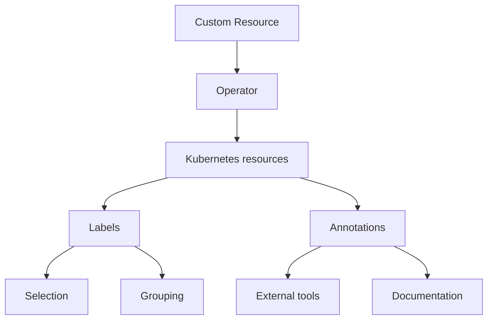

# Labels and annotations

[Labels :octicons-link-external-16:](https://kubernetes.io/docs/concepts/overview/working-with-objects/labels/)
and [annotations :octicons-link-external-16:](https://kubernetes.io/docs/concepts/overview/working-with-objects/annotations/)
are used to attach additional metadata information to Kubernetes resources.

Labels and annotations are rather similar but differ in purpose. 

**Labels** are used by Kubernetes to identify and select objects. They enable filtering and grouping, allowing users to apply selectors for operations like deployments or scaling. 

**Annotations** are assigning additional *non-identifying* information that doesn't affect how Kubernetes processes resources. They store descriptive information like deployment history, monitoring configurations or external integrations. 

The following diagram illustrates this difference:



Both Labels and Annotations are assigned to the following objects managed by Percona Operator for MySQL:

* Custom Resource Definitions
* Custom Resources
* Deployments
* Services
* StatefulSets
* PVCs
* Pods
* ConfigMaps and Secrets

## When to use labels and annotations

Use **Labels** when:

* The information is used for object selection
* The data is used for grouping or filtering
* The information is used by Kubernetes controllers
* The data is used for operational purposes

Use **Annotations** when:

* The information is for external tools
* The information is used for debugging
* The data is used for monitoring configuration

## Labels and annotations used by Percona Operator for MySQL

### Labels

| Name                        | Objects                          | Description                                      | Example values                          |
|-----------------------------|-----------------------------------|------------------------------------------------|-----------------------------------------|
| `app.kubernetes.io/name`      | Services, StatefulSets, Deployments, etc. | Specifies the name of the application          | percona-server  |
| `app.kubernetes.io/instance`  | Services, StatefulSets, Deployments | Identifies a specific instance of the application | cluster1 |
| `app.kubernetes.io/managed-by`| Services, StatefulSets           | Indicates the controller managing the object    | percona-server-operator |
| `app.kubernetes.io/component`| Services, StatefulSets           | Specifies the component within the application  | mysql, haproxy, router                  |
| `app.kubernetes.io/part-of`   | Services, StatefulSets           | Indicates the higher-level application the object belongs to | percona-server                          |
| `app.kubernetes.io/version`  | CustomResourceDefinition          | Specifies the version of the Percona MySQL Operator. | {{release}} |
|`percona.com/exposed` | Services | Indicates if the service is exposed externally | true, false |

### Annotations

| Name                                              | Objects  | Description                                   | Example Values              |
|---------------------------------------------------|----------|-----------------------------------------------|-----------------------------|
| `service.beta.kubernetes.io/aws-load-balancer-backend-protocol` | Services | Specifies the protocol for AWS load balancers | http, http-test             |
| `service.beta.kubernetes.io/aws-load-balancer-backend`         | Services | Specifies the backend type for AWS load balancers | test-type                  |
| `controller-gen.kubebuilder.io/version`     | CustomResourceDefinition          | Indicates the version of the Kubebuilder controller-gen tool used.             |

## Setting labels and annotations in the Custom Resource

You can define both Labels and Annotations as `key-value` pairs in the metadata section of a YAML manifest for a specific resource. For example, specifying labels and annotations in the `deploy/cr.yaml` Custom Resource looks as follows:

```yaml
apiVersion: ps.percona.com/v1alpha1
kind: PerconaServerMySQL
metadata:
  name: cluster1
  annotations:
    percona.com/issue-vault-token: "true"
  labels:
    ...
```

## Querying labels and annotations

To check which **labels** are attached to a specific object, use the additional `--show-labels` option of the `kubectl get` command.

For example, to see the Operator version associated with a Custom Resource Definition, use the following command:

```{.bash data-prompt="$"}
$ kubectl get crd perconaservermysqls.ps.percona.com --show-labels
```

??? example "Sample output"

    ```{.text .no-copy}
    NAME                                 CREATED AT             LABELS
    perconaservermysqls.ps.percona.com   2025-05-23T10:40:54Z   mysql.percona.com/version=v0.10.0
    ```

To check **annotations** associated with an object, use the following command: 

``` {.bash data-prompt="$" }
kubectl get <resource> <resource-name> -o jsonpath='{.metadata.annotations}'
```

For example, this command lists annotations assigned to a `cluster1-mysql-0` Pod:

``` {.bash data-prompt="$" }
$ kubectl get pod cluster1-mysql-0 -o jsonpath='{.metadata.annotations}'
```

??? example "Sample output"

    ```{.json .no-copy}
    {"percona.com/last-applied-tls":"c8dfc846cb62b75ba8eab61b7e86a46c"}
    ```

## <a name="annotations-ignore"></a>Specifying labels and annotations ignored by the Operator

Sometimes various Kubernetes flavors can add their own annotations to the
objects managed by the Operator.

The Operator keeps track of all changes to its objects and can remove
annotations that it didn't create.

If there are no annotations or labels in the Custom Resource, the Operator does
nothing if a new label or an annotation is added to the object.

If there is an annotation or a label specified in the Custom Resource, the
Operator starts to manage annotations and labels. In this case it removes
unknown annotations and labels.

A cloud provider can add own labels and annotations. Or you may have custom automation tools that add own labels or annotations and you need to keep them. To do this, you can specify which annotations and labels the Operator should ignore by listing them in the `spec.ignoreAnnotations` or
`spec.ignoreLabels` keys of the `deploy/cr.yaml`, as follows:

```yaml
spec:
  ignoreAnnotations:
    - some.custom.cloud.annotation/smth
  ignoreLabels:
    - some.custom.cloud.label/smth
...
```

The Operator will ignore any annotation and label which keys **starts** with the
mentioned above examples. For example, the following annotations and labels will
be ignored after applying the above `cr.yaml` fragment:

```yaml
annotations:
  some.custom.cloud.annotation/smth: somethinghere
labels:
  some.custom.cloud.label/smth: somethinghere
```

The Operator will ignore specified annotations and labels for all objects: Pods,
Services, etc.

