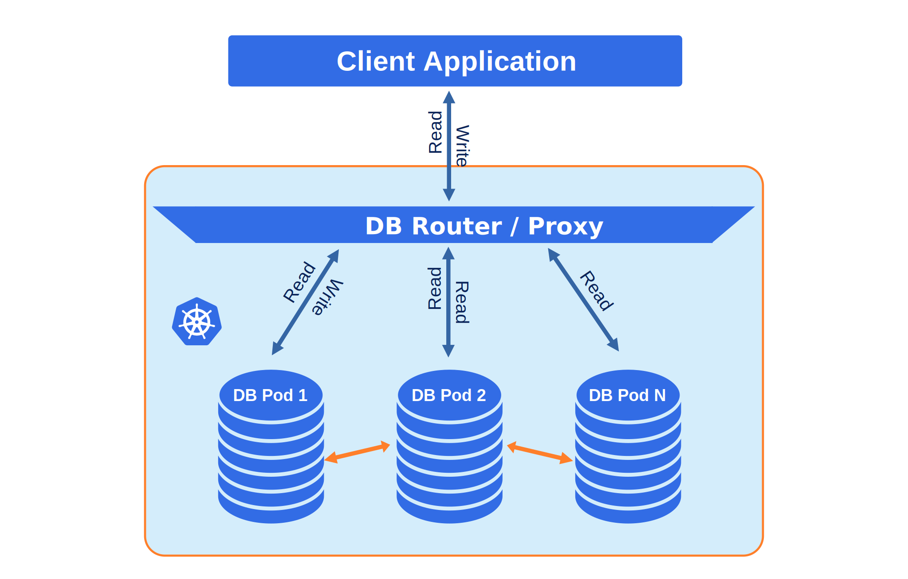

# Design overview

The Percona Operator for MySQL automates and simplifies deploying
and managing open source MySQL clusters on Kubernetes.

Containers deployed with the Operator include the following components:

* [Percona Server for MySQL :octicons-link-external-16:](https://www.percona.com/doc/percona-server/LATEST/index.html) - a free, fully compatible, enhanced, and open source drop-in replacement for any MySQL database,

* [Percona XtraBackup :octicons-link-external-16:](https://www.percona.com/doc/percona-xtrabackup/8.0/index.html) - a hot backup utility for MySQL based servers that doesn’t lock your database during the backup,

* [Orchestrator :octicons-link-external-16:](https://github.com/openark/orchestrator) - a replication topology manager for MySQL used when [asynchronous replication :octicons-link-external-16:](https://dev.mysql.com/doc/refman/8.0/en/group-replication-primary-secondary-replication.html) between MySQL instances [is turned on](operator.md#mysql-clustertype),

* [HAProxy :octicons-link-external-16:](https://haproxy.org) - a load balancing and proxy service compatible with both [asynchronous replication :octicons-link-external-16:](https://dev.mysql.com/doc/refman/8.0/en/group-replication-primary-secondary-replication.html) and [group replication :octicons-link-external-16:](https://dev.mysql.com/doc/refman/8.0/en/group-replication.html)  between MySQL instances,

* [MySQL Router :octicons-link-external-16:](https://dev.mysql.com/doc/mysql-router/8.0/en/) - a proxy solution which can be used instead of HAProxy when [group replication :octicons-link-external-16:](https://dev.mysql.com/doc/refman/8.0/en/group-replication.html) between MySQL instances [is turned on](operator.md#mysql-clustertype),

* [Percona Toolkit :octicons-link-external-16:](https://docs.percona.com/percona-toolkit/) - a set of tools useful in debugging MySQL Pods.

The design of the Operator is highly bound
to Percona Server for MySQL and the high availability implementation based on Orchestrator,
which in its turn can be briefly described with the following diagram.

Being a regular MySQL Server instance, each node contains the same set
of data synchronized across nodes. The recommended configuration is to
have at least 3 nodes. In a basic setup with this amount of nodes,
Percona Server for MySQL provides high availability, continuing to
function if you take any of the nodes down.

To provide high availability operator uses [node affinity :octicons-link-external-16:](https://kubernetes.io/docs/concepts/configuration/assign-pod-node/#affinity-and-anti-affinity)
to run Percona Server for MySQL instances on separate worker nodes if possible. If
some node fails, the pod in it is automatically re-created on another node.

To provide data storage for stateful applications, Kubernetes uses
Persistent Volumes. A *PersistentVolumeClaim* (PVC) is used to implement
the automatic storage provisioning to pods. If a failure occurs, the
Container Storage Interface (CSI) should be able to re-mount storage on
a different node. The PVC StorageClass must support this feature
(Kubernetes and OpenShift support this in versions 1.9 and 3.9
respectively).

The Operator functionality extends the Kubernetes API with
*PerconaServerMySQL* object, and it is implemented as a golang
application. Each *PerconaServerMySQL* object maps to one separate MySQL setup.
The Operator listens to all events on the created objects.
When a new PerconaServerMySQL object is created, or an existing one undergoes
some changes or deletion, the Operator automatically
creates/changes/deletes all needed Kubernetes objects with the
appropriate settings to provide a proper Percona Server for MySQL operation.

## Replication types and proxy solutions

The process in which data from a *primary* MySQL instance is copied and sent to
other MySQL instances of the database cluster (co-called *replicas*) is known as
*MySQL replication*.

The Operator [provides you a choice](operator.md#mysql-clustertype) between two
replication types: 

* **Asynchronous replication** means that write is completed on the
    primary and is not influenced by the replicas themselves. After completion
    of its changes, the primary populates the binary log with the data
    modification or the actual statement. Then the replica executes each change
    on its own database and obtains consistent set of data.

* **Group Replication** means that read-write transaction can be executed on any
    instance, and when it happens, MySQL tries to get consensus with the other
    instances before returning it completed back to the client. 

Both replication types have their pros and cons.

*Asynchronous replication* is faster. Also, you can distribute read and write
requests of your application to different instances. From the other hand, it can
be less reliable in terms of consistency: replicas may lag behind the primary
instance, impacting any applications that depend on real-time data. Also, some
transaction committed on the primary instance may not be available on replicas
if the primary fails. Finally, asynchronous replication doesn't allow you
scaling write requests horizontally, leaving  vertical scaling (primary
instance RAM and CPU increase) as the only available option.

*Group replication* is good at horizontal scaling of writes, but is not so fast,
because writes require consensus (so-called "certification").
Also, concurrent writes of the same row on different instances are
[treated as data conflicts :octicons-link-external-16:](https://dev.mysql.com/doc/refman/8.0/en/group-replication-summary.html):
the transaction that was ordered first commits on all servers, and the
transaction ordered second aborts. Finally, group replication has some
[specific limitations :octicons-link-external-16:](https://dev.mysql.com/doc/refman/8.0/en/group-replication-limitations.html).
Particularly, the number of MySQL instances in a single replication group can't
exceed 9. Also, extra large transaction can cause noticeable system slowdown,
and in some cases even can cause the [replication member fault :octicons-link-external-16:](https://dev.mysql.com/doc/refman/8.0/en/group-replication-limitations.html#group-replication-limitations-transaction-size)
when transaction message cannot be copied between group members over the
network within a 5-second window.

Proxy solution used by the Operator for the database cluster depends on the
replication type used in the cluster. [HAProxy](haproxy-conf.md) can be used
with both replication types, while [MySQL Router](router-conf.md) can be used
with Group Replication.
