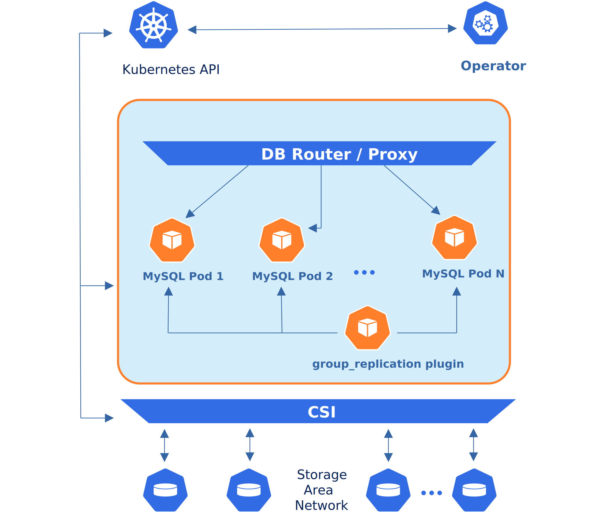

# Design overview

The Percona Operator for MySQL automates deploying and operating
open source MySQL clusters on Kubernetes.

Containers deployed with the Operator include the following components:

* [Percona Server for MySQL :octicons-link-external-16:](https://www.percona.com/doc/percona-server/LATEST/index.html) - a free, fully compatible, enhanced, and open source drop-in replacement for any MySQL database,

* [Percona XtraBackup :octicons-link-external-16:](https://www.percona.com/doc/percona-xtrabackup/8.0/index.html) - a hot backup utility for MySQL based servers that doesn’t lock your database during the backup,

* [Orchestrator :octicons-link-external-16:](https://github.com/openark/orchestrator) - a replication topology manager for MySQL used when [asynchronous replication :octicons-link-external-16:](https://dev.mysql.com/doc/refman/8.0/en/group-replication-primary-secondary-replication.html) between MySQL instances [is turned on](operator.md#mysqlclustertype),

* [HAProxy :octicons-link-external-16:](https://haproxy.org) - a load balancing and proxy service compatible with both [asynchronous replication :octicons-link-external-16:](https://dev.mysql.com/doc/refman/8.0/en/group-replication-primary-secondary-replication.html) and [group replication :octicons-link-external-16:](https://dev.mysql.com/doc/refman/8.0/en/group-replication.html)  between MySQL instances,

* [MySQL Router :octicons-link-external-16:](https://dev.mysql.com/doc/mysql-router/8.0/en/) - a proxy solution which can be used instead of HAProxy when [group replication :octicons-link-external-16:](https://dev.mysql.com/doc/refman/8.0/en/group-replication.html) between MySQL instances [is turned on](operator.md#mysqlclustertype),

* [Percona Toolkit :octicons-link-external-16:](https://docs.percona.com/percona-toolkit/) - a set of tools useful in debugging MySQL Pods.

The Operator architecture builds on Percona Server for MySQL. For asynchronous
replication, it leverages Orchestrator to manage topology and failover,
as illustrated below.

Being a regular MySQL Server instance, each node contains the same set
of data synchronized across nodes. The recommended configuration is to
have at least 3 nodes. In a basic setup with this amount of nodes,
Percona Server for MySQL provides high availability, continuing to
function if you take any of the nodes down.

## High availability

To provide high availability, the Operator uses [node-affinity :octicons-link-external-16:](https://kubernetes.io/docs/concepts/scheduling-eviction/assign-pod-node/#affinity-and-anti-affinity)
to run Percona Server for MySQL instances on separate worker nodes when possible. If
some node fails, Kubernetes reschedules the affected Pod on another node. With asynchronous
replication, Orchestrator handles primary election and topology recovery. 

With Group
Replication, recovery is coordinated by the group membership protocol. 

Clients connect
via HAProxy or MySQL Router to reach a healthy writer/reader instance.

## How the Operator works

The Operator extends the Kubernetes API with a special `PerconaServerMySQL` object. It's a Go application that watches for events on these objects. Each `PerconaServerMySQL` object maps to one separate MySQL setup.

When you create, change, or delete a `PerconaServerMySQL` object, the Operator automatically creates or updates the necessary Kubernetes resources, like Pods and StatefulSets, to ensure your database cluster matches the desired state.

For storage, the Operator leverages Persistent Volumes (PVs) and PersistentVolumeClaims (PVCs) to ensure your data is durable. A *PersistentVolumeClaim* (PVC) is used to implement
the automatic storage provisioning to pods. The Container Storage Interface (CSI) allows the storage to be re-mounted on a different node if a failure occurs.

## Replication types and proxy solutions

The process in which data from a *primary* MySQL instance is copied and sent to
other MySQL instances of the database cluster (so-called *replicas*) is known as
*MySQL replication*.

The Operator [provides you a choice](operator.md#mysqlclustertype) between two
replication types:

* **Asynchronous replication** means that a write is completed on the
    primary and is not influenced by the replicas themselves. After completion
    of its changes, the primary populates the binary log with the data
    modification or the actual statement. Then the replica executes each change
    on its own database and obtains consistent set of data.

* **Group Replication** means that a read transaction can be executed on any
    instance, while write transactions happen only on primary. For a write transaction, MySQL tries to get consensus with the other
    instances before returning it completed back to the client.

Both replication types have their pros and cons.

*Asynchronous replication* is faster. Also, you can distribute read
requests of your application to different instances. On the other hand, it can
be less reliable in terms of consistency: replicas may lag behind the primary
instance, impacting any applications that depend on real-time data. Also, some
transaction committed on the primary instance may not be available on replicas
if the primary fails. Finally, asynchronous replication doesn't allow you
scaling write requests horizontally, leaving vertical scaling (primary
instance RAM and CPU increase) as the only available option.

*Group replication* allows horizontal scaling of reads, preventing stale reads when set with high transaction consistency level, but it is slower. Group replication has some
[specific limitations :octicons-link-external-16:](https://dev.mysql.com/doc/refman/8.0/en/group-replication-limitations.html).
Particularly, the number of MySQL instances in a single replication group can't
exceed 9. Also, extra large transactions can cause noticeable system slowdown,
and in some cases even can cause the [replication member fault :octicons-link-external-16:](https://dev.mysql.com/doc/refman/8.0/en/group-replication-limitations.html#group-replication-limitations-transaction-size)
when transaction message cannot be copied between group members over the
network within a 5-second window.

!!! note

    MySQL documentation may also use the terms "source/replica" instead of
    "primary/replica".

Proxy solution used by the Operator for the database cluster depends on the
replication type used in the cluster. [HAProxy](haproxy-conf.md) can be used
with both replication types, while [MySQL Router](router-conf.md) can be used
with Group Replication.

### Replication and proxy comparison

| Feature | Asynchronous replication + HAProxy | Group Replication + HAProxy/MySQL Router |
| --- | --- | --- |
| Writes | Single primary | Single primary |
| Read scaling | Yes | Yes |
| Write scaling | No | No |
| Consistency | Eventual on replicas | Stronger (depending the [Transaction Consistency](https://dev.mysql.com/doc/refman/8.4/en/group-replication-configuring-consistency-guarantees.html)) |
| Latency | Low | Higher (due to sync)
| Failover | Orchestrator elects new primary | Native group membership |
| Max nodes | Higher (practical limits) | 9 per group |
| Proxy | HAProxy | HAProxy or MySQL Router |

Tip: Choose Group Replication for stronger consistency and read scaling; choose
asynchronous replication for lower write latency and simpler topology.

### What to read next

* [Operator configuration and Custom Resources](operator.md#perconaservermysql)
* [HAProxy configuration](haproxy-conf.md)
* [MySQL Router configuration](router-conf.md)
* [Backups](backups.md)
* [Updating and upgrades](update.md)
