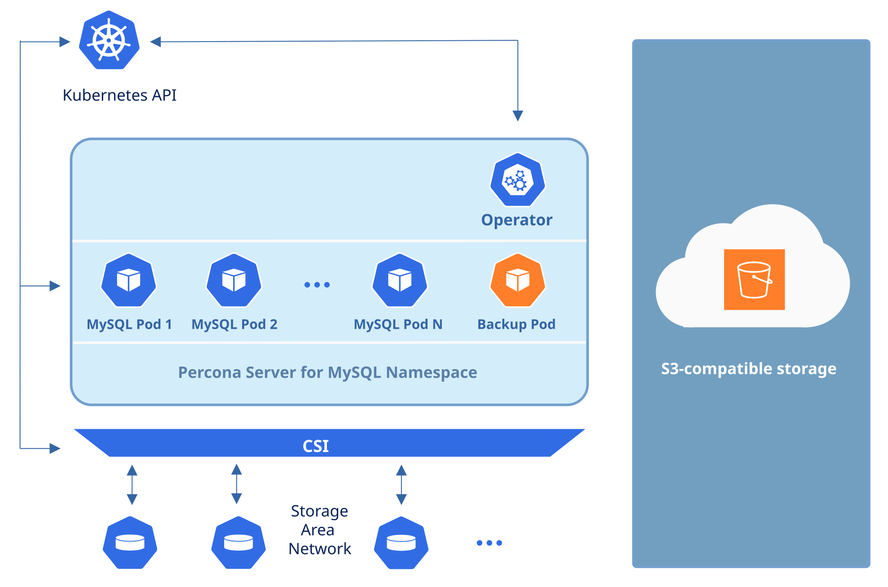
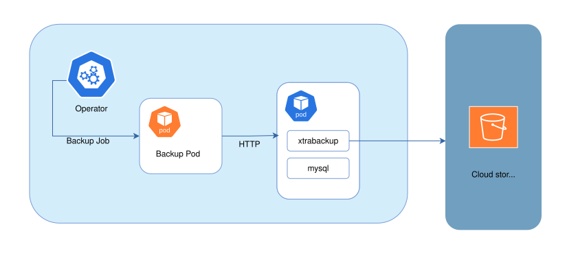

# About backups

Backing up your database protects your data from loss and corruption, helps ensure business continuity, and lets you quickly recover if something goes wrong.

## How backups work

The Operator stores your MySQL backups outside the Kubernetes cluster on cloud storage. You can use:

* [Amazon S3 or S3-compatible storage :octicons-link-external-16:](https://en.wikipedia.org/wiki/Amazon_S3#S3_API_and_competing_services)
* [Azure Blob Storage :octicons-link-external-16:](https://azure.microsoft.com/en-us/services/storage/blobs/)
* [Google Cloud Storage :octicons-link-external-16:](https://cloud.google.com/storage)



The Operator creates physical backups using [Percona XtraBackup :octicons-link-external-16:](https://docs.percona.com/percona-xtrabackup/latest/). Here's how it works:

1. Each database Pod includes a sidecar container called `xtrabackup` that runs an HTTP server.
2. When you create a backup, the Operator creates a Job that sends an HTTP request to the backup source Pod.
3. The `xtrabackup` container receives the request and starts the backup process.
4. Backups are streamed to storage; the Operator does not keep a separate local copy of the backup on disk.

The following diagram outlines this workflow:



## Backup types

You can make the following types of physical backups:

* Full backup - contains full data set
* An incremental backup - contains only the changes that occurred since the previous backup. To learn more, read [Incremental backups](backups-incremental.md). 

## Configuring backups

You configure backups in the `backup` section of the 
[deploy/cr.yaml :octicons-link-external-16:](https://github.com/percona/percona-server-mysql-operator/blob/v{{release}}/deploy/cr.yaml) file. At minimum, you must:

* Set [backup.enabled](operator.md#backupenabled) to `true` to enable backups
* Configure at least one [storage location](backups-storage.md) in `backup.storages` subsection.

You can customize a backup type, scheduling and encryption. See [Making scheduled backups](backups-scheduled.md), [Creating a backup on demand](backups-ondemand.md), and [Encrypted backups](backups-encrypted.md) tutorials for the guidelines.

To run parallel backups and fine-tune how long a backup waits to start, see [Run multiple backups](#run-multiple-backups). To suspend backups when the cluster is unhealthy, see [Suspend backups on an unhealthy cluster](#suspend-backups-on-an-unhealthy-cluster).

For the full set of backup-related fields, see the [Custom Resource reference](operator.md#operator-backup-section) and the [Backup Resource reference](backup-cr.md) for per-backup options.

## Backup runs

You can create backups in two ways:

* **Scheduled backups**: Configure these in your
    [deploy/cr.yaml :octicons-link-external-16:](https://github.com/percona/percona-server-mysql-operator/blob/v{{release}}/deploy/cr.yaml)
    file. The Operator runs them automatically at the times you specify.
* **On-demand backups**: Create these manually whenever you need them. You configure them in the
    [deploy/backup/backup.yaml :octicons-link-external-16:](https://github.com/percona/percona-server-mysql-operator/blob/v{{release}}/deploy/backup/backup.yaml)
    file.

## Run multiple backups

!!! note "Version added: [1.3.0](ReleaseNotes/Kubernetes-Operator-for-PS-RN1.3.0.md)"

You can run more than one backup for the same cluster at the same time. For example, schedule weekly backups on one storage and daily backups on another one. You can also run an on-demand backup to be on the safe side before you do some maintenance work.

### Run parallel backups

To run multiple backups in parallel, set the `backup.allowParallel` option in the `deploy/cr.yaml` Custom Resource manifest to `true`:

```yaml
backup:
  allowParallel: true
```

If parallel backups start at the same time and share a storage location, they can overwrite each other. Use a separate storage name (different bucket or prefix) for backups that might run together. See [Managing multiple backup schedules in the same storage](backups-scheduled.md#managing-multiple-backup-schedules-in-the-same-storage). Incremental backups that belong to the same chain still run sequentially.

### Run one backup at a time

If you omit `allowParallel` or set it to `false`, the Operator runs one backup per cluster at a time. A second scheduled or on-demand backup waits until the first succeeds or fails.

### Set a waiting time for a backup to start 

You can fine-tune a backup queue by assigning a waiting time for a backup to start. 

Use the [`backup.startingDeadlineSeconds`](operator.md#backupstartingdeadlineseconds) option in the `deploy/cr.yaml` file to set this time for all backups. Override it for an on-demand backup by setting the [`startingDeadlineSeconds`](backup-cr.md#startingdeadlineseconds) option on the `PerconaServerMySQLBackup` object. If the Operator does not create the Job before this time expires, the backup state becomes `Error` with `stateDescription: backup did not start before startingDeadlineSeconds expired`.

This timer also covers a backup that is waiting because the cluster is not ready. See [Suspend backups on an unhealthy cluster](#suspend-backups-on-an-unhealthy-cluster).

## Suspend backups on an unhealthy cluster

!!! note "Version added: [1.3.0](ReleaseNotes/Kubernetes-Operator-for-PS-RN1.3.0.md)"

Your database cluster can become unhealthy. For example, when one of the Pods crashes and restarts. The Operator monitors the database cluster state while a backup is running and suspends it for an unhealthy cluster to reduce the load on the cluster.


When the cluster is ready again, the Operator resumes the backup Job. Resuming a Job creates a new Pod, so the backup starts over from the beginning rather than continuing from where it stopped.

To offload the database cluster even more, you can define how long a backup remains suspended. Use the [`backup.suspendedDeadlineSeconds`](operator.md#backupsuspendeddeadlineseconds) option in the `cr.yaml` file for all backups. Or override it with the [`suspendedDeadlineSeconds`](backup-cr.md#suspendeddeadlineseconds) option in the `deploy/backup/backup.yaml` configuration files for a specific backup. The setting in the `backup.yaml` file has a higher priority.

After this duration expires, the Operator automatically marks this backup as `Failed` with `stateDescription: backup did not resume before suspendedDeadlineSeconds expired`, and deletes the suspended Job.

A backup that has not started yet does not move to `Suspended`. If the cluster is still unready when `startingDeadlineSeconds` expires, the backup state changes to `Error`. See [Set how long a backup waits to start](#set-how-long-a-backup-waits-to-start).

For the full list of backup states, see [Backup state values](cr-statuses.md#backup-state-values).

## Point-in-time recovery

Starting with Operator 1.1.0, you can combine a base backup with archived binary logs to [restore to a specific GTID or timestamp](backups-restore-pitr.md). [Enable binlog collection](backups-pitr.md#enable-binlog-collection) to stream binlogs to the object
storage alongside your normal backup configuration.
