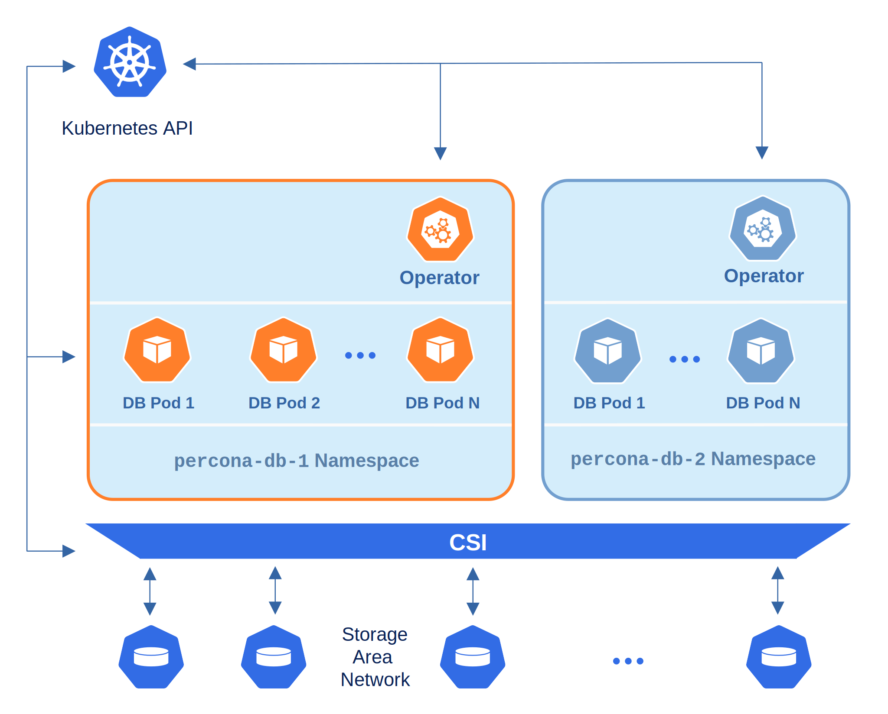
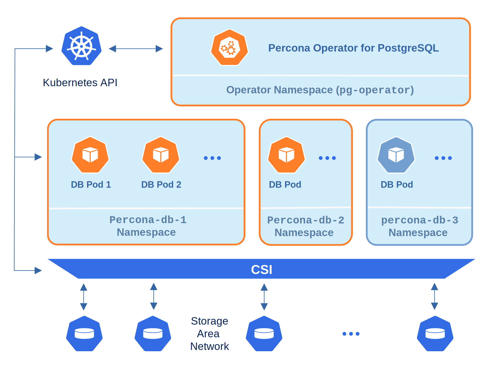

# Percona Operator for MySQL single-namespace and multi-namespace deployment

There are two design patterns that you can choose from when deploying Percona Operator for MySQL and Percona Server for MySQL clusters in Kubernetes:

* Namespace-scope - one Operator per Kubernetes namespace,

* Cluster-wide - one Operator can manage clusters in multiple namespaces.

This how-to explains how to configure Percona Operator for MySQL based on Percona Server for MySQL for each scenario.

## Namespace-scope

By default, Percona Operator for MySQL functions in a specific Kubernetes namespace. You can
create one during the installation (like it is shown in the
[installation instructions](kubernetes.md)) or just use the `default` namespace. This approach allows several Operators to co-exist in one Kubernetes-based environment, being separated in different namespaces:



Normally this is a recommended approach, as isolation minimizes impact in case of various failure scenarios. This is the default configuration of our Operator.

Let’s say you will use a Kubernetes Namespace called `percona-db-1`.

1. Clone `percona-server-mysql-operator` repository:

    ``` {.bash data-prompt="$" }
    $ git clone -b v{{ release }} https://github.com/percona/percona-server-mysql-operator
    $ cd percona-server-mysql-operator
    ```

2. Create your `percona-db-1` Namespace (if it doesn't yet exist) as follows:

    ``` {.bash data-prompt="$" }
    $ kubectl create namespace percona-db-1
    ```

3. Deploy the Operator [using :octicons-link-external-16:](https://kubernetes.io/docs/reference/using-api/server-side-apply/)
    the following command:

    ``` {.bash data-prompt="$" }
    $ kubectl apply --server-side -f deploy/bundle.yaml -n percona-db-1
    ```

4. Once Operator is up and running, deploy the database cluster itself:

    ``` {.bash data-prompt="$" }
    $ kubectl apply -f deploy/cr.yaml -n percona-db-1
    ```

You can deploy multiple clusters in this namespace.

### Add more namespaces

What if there is a need to deploy clusters in another namespace? The solution for namespace-scope deployment is to have more than one Operator. We will use the `percona-db-2` namespace as an example.

1. Create your `percona-db-2` namespace (if it doesn't yet exist) as follows:

    ``` {.bash data-prompt="$" }
    $ kubectl create namespace percona-db-2
    ```

2. Deploy the Operator:

    ``` {.bash data-prompt="$" }
    $ kubectl apply --server-side -f deploy/bundle.yaml -n percona-db-2
    ```

3. Once Operator is up and running deploy the database cluster itself:

    ``` {.bash data-prompt="$" }
    $ kubectl apply -f deploy/cr.yaml -n percona-db-2
    ```

    !!! note

        Cluster names may be the same in different namespaces.

## Install the Operator cluster-wide

Sometimes it is more convenient to have one Operator watching for
Percona Server for MySQL custom resources in several namespaces.

We recommend running Percona Operator for MySQL in a traditional way,
limited to a specific namespace, to limit the blast radius. But it is possible
to run it in so-called *cluster-wide* mode, one Operator watching several
namespaces, if needed:



To use the Operator in such cluster-wide mode, you should install it with a
different set of configuration YAML files, which are available in the deploy
folder and have filenames with a special `cw-` prefix: e.g.
`deploy/cw-bundle.yaml`.

While using this cluster-wide versions of configuration files, you should set
the following information there:

* `subjects.namespace` option should contain the namespace which will host
    the Operator,
* `WATCH_NAMESPACE` key-value pair in the `env` section should have
    `value` equal to a  comma-separated list of the namespaces to be watched by
    the Operator (or just a blank string to make the Operator deal with
    *all namespaces* in a Kubernetes cluster).

The following simple example shows how to install Operator cluster-wide on
Kubernetes.

1. Clone `percona-server-mysql-operator` repository:

    ``` {.bash data-prompt="$" }
    $ git clone -b v{{ release }} https://github.com/percona/percona-server-mysql-operator
    $ cd percona-server-mysql-operator
    ```

2. Let’s say you will use `ps-operator` namespace for the Operator, and `percona-db-1`
    namespace for the cluster. Create these namespaces, if needed:

    ``` {.bash data-prompt="$" }
    $ kubectl create namespace ps-operator
    $ kubectl create namespace percona-db-1
    ```

3. Edit the ``deploy/cw-bundle.yaml`` configuration file to make sure it
    contains proper namespace name for the Operator:

    ```yaml
    ...
    subjects:
    - kind: ServiceAccount
      name: percona-server-mysql-operator
      namespace: ps-operator
    ...
    spec:
      containers:
      - command:
        ...
        env:
        - name: WATCH_NAMESPACE
          value: "percona-db-1"
        ...
    ```

4. Apply the `deploy/cw-bundle.yaml` file with the following command:

    ``` {.bash data-prompt="$" }
    $ kubectl apply --server-side -f deploy/cw-bundle.yaml -n ps-operator
    ```

    Right now the operator deployed in cluster-wide mode will monitor all
    namespaces in the cluster, either already existing or newly created ones.

5. Deploy the cluster in the namespace of your choice:

    ``` {.bash data-prompt="$" }
    $ kubectl apply -f deploy/cr.yaml -n percona-db-1
    ```

## Verifying the cluster operation

When creation process is over, you can try to connect to the cluster.



!!! note 

    Some Kubernetes-based environments are specifically configured to have
    communication across Namespaces is not allowed by default network policies.
    In this case, you should specifically allow the Operator communication
    across the needed Namespaces. Following the above example, you would need
    to allow ingress traffic for the `ps-operator` Namespace from the `percona-db-1`
    Namespace, and also from the `default` Namespace. You can do it with the
    NetworkPolicy resource, specified in the YAML file as follows:
    
    ```yaml
    apiVersion: networking.k8s.io/v1
    kind: NetworkPolicy
    metadata:
      name: percona
      namespace: ps-operator
    spec:
      ingress:
      - from:
        - namespaceSelector:
            matchLabels:
              kubernetes.io/metadata.name: percona-db-1
        - namespaceSelector:
            matchLabels:
              kubernetes.io/metadata.name: default
      podSelector: {}
      policyTypes:
      - Ingress
    ```
    
    Don't forget to apply the resulting file with the usual `kubectl apply`
    command.

    You can find more details about Network Policies [in the official Kubernetes documentation](https://kubernetes.io/docs/concepts/services-networking/network-policies/). 

## Upgrading the Operator in cluster-wide mode

Cluster-wide Operator is upgraded similarly to a single-namespace one. Both deployment variants provide you with the same three upgradable components:

* the Operator;
* [Custom Resource Definition (CRD)](operator.md),
* Database Management System (Percona Server for MySQL).
 
To upgrade the cluster-wide Operator you follow the [standard upgrade scenario](update.md#upgrading-the-operator-and-crd) concerning the Operator's namespace and a different YAML configuration file: the one with a special `cw-` prefix, `deploy/cw-rbac.yaml`. The resulting steps will look as follows.

1. Update the [Custom Resource Definition](https://kubernetes.io/docs/concepts/extend-kubernetes/api-extension/custom-resources/)
    for the Operator, and do the same for the Role-based access control:

    ``` {.bash data-prompt="$" }
    $ kubectl apply -f deploy/crd.yaml
    $ kubectl apply -f deploy/cw-rbac.yaml
    ```

2. Now you should [apply a patch](https://kubernetes.io/docs/tasks/run-application/update-api-object-kubectl-patch/) to your
    deployment, supplying the necessary image name with a newer version tag. You can find the proper
    image name for the current Operator release [in the list of certified images](images.md).
    For example, updating to the `{{ release }}` version in the `ps-operator` namespace should look as
    follows.

    ``` {.bash data-prompt="$" }
    $ kubectl patch deployment percona-server-mysql-operator \
      -p'{"spec":{"template":{"spec":{"containers":[{"name":"percona-server-mysql-operator","image":"percona/percona-server-mysql-operator:{{ release }}"}]}}}}' -n ps-operator
    ```

3. The deployment rollout will be automatically triggered by the applied patch.
    You can track the rollout process in real time with the
    `kubectl rollout status` command with the name of your cluster:

    ``` {.bash data-prompt="$" }
    $ kubectl rollout status deployments percona-server-mysql-operator -n ps-operator
    ```
