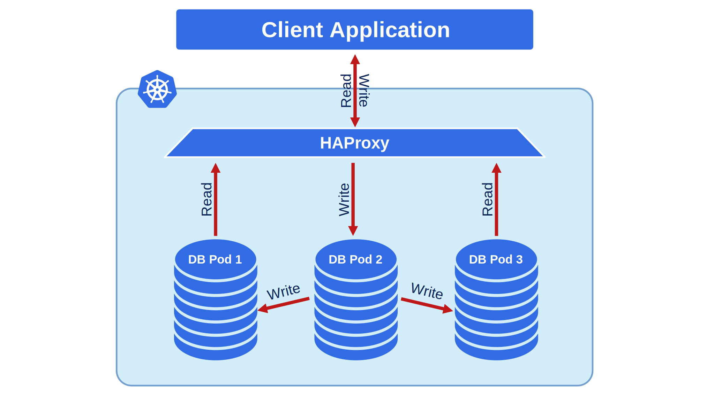

# Expose cluster

The Operator provides different ways to access your MySQL database cluster. Each way uses Kubernetes [Service objects :octicons-link-external-16:](https://kubernetes.io/docs/
concepts/services-networking/service/) to expose the cluster to client applications. These Service objects are configured by the Operator.

This document shows you how to configure cluster exposure using options in the [Custom Resource manifest](operator.md). The available options depend on the [replication type](architecture.md#replication-types-and-proxy-solutions) of your cluster.

For a cluster with [Asynchronous :octicons-link-external-16:](https://dev.mysql.com/doc/refman/8.0/en/replication.html) replication, your options are:

* [Use HAProxy](#use-haproxy)
* [Use the Primary Service](#use-primary-service)

For a cluster with [Group Replication :octicons-link-external-16:](https://dev.mysql.com/doc/refman/8.0/en/group-replication.html), your options are:

* [Use HAProxy](#use-haproxy) - recommended
* [Use MySQL Router](#use-mysql-router)
* [Use the Primary Service](#use-primary-service)

## Use HAProxy 

HAProxy provides load balancing and proxy service for your cluster. It's enabled by default and works with both replication types.



To enable HAProxy, set the following in your `deploy/cr.yaml` manifest:

=== "Asynchronous replication"

    ```yaml
    mysql:
      clusterType: async
      ....
      haproxy: 
        enabled: true
        size: 3
        image: perconalab/percona-server-mysql-operator:{{ release }}-haproxy
    ```

=== "Group replication"

    ```yaml
    mysql:
      clusterType: group-replication
      ....
      haproxy:
        enabled: true
        size: 3
        image: perconalab/percona-server-mysql-operator:{{ release }}-haproxy
    ```

The created HAProxy service (`cluster1-haproxy`) listens on the following ports:

- `3306`: MySQL primary
- `3307`: MySQL replicas  
- `3309`: [Proxy protocol :octicons-link-external-16:](https://www.haproxy.com/blog/haproxy/proxy-protocol/)

To find your HAProxy endpoint, run:

```{.bash data-prompt="$"}
$ kubectl get service cluster1-haproxy
```

??? example "Sample output"

    ```{.text .no-copy}
    NAME               TYPE        CLUSTER-IP    EXTERNAL-IP   PORT(S)                      AGE
    cluster1-haproxy   ClusterIP   10.76.2.102   <none>        3306/TCP,3307/TCP,3309/TCP   2m32s
    ```

## Use MySQL Router

MySQL Router provides intelligent routing for group replication clusters. This option is left for backward compatibility. We recommend to [Use HAProxy](#use-haproxy) for exposing the cluster.

You can expose the cluster through a `<CLUSTER_NAME>-router` Kubernetes Service.


To configure MySQL Router with the LoadBalancer expose type, modify the `spec.router` section in `deploy/cr.yaml` manifest:

```yaml
mysql:
  clusterType: group-replication
  ...
router:
  expose:
    type: LoadBalancer
```

To find your MySQL Router endpoint, run:

```{.bash data-prompt="$"}
$ kubectl get service cluster1-router
```

??? example "Sample output"

    ```{.text .no-copy}
    NAME                TYPE           CLUSTER-IP    EXTERNAL-IP     PORT(S)                                                       AGE
    my-cluster-router   LoadBalancer   10.20.22.90   35.223.42.238   6446:30852/TCP,6447:31694/TCP,6448:31515/TCP,6449:31686/TCP   18h
    ```

The MySQL Router service provides these ports:

* `3306` - read/write, default MySQL clients connection,
* `33062` - read/write, port for MySQL administrative connections,
* `6446` - read/write, routing traffic to a Primary node,
* `6447` - read-only, load balancing the traffic across Replicas.

Additional ports `6448` and `6449` are available to
connect via [MySQL X Protocol :octicons-link-external-16:](https://dev.mysql.com/doc/dev/
mysql-server/latest/page_mysqlx_protocol.html). This is 
useful for operations such as asynchronous calls.

## Use Primary Service

You can expose your cluster without the proxy by exposing the primary Pod directly. Specify the `spec.mysql.exposePrimary.enabled` option to `true` in your Custom Resource. This creates  the `<CLUSTER_NAME>-mysql-primary` service for connecting to the cluster.


You can change the type of the Service object by setting `mysql.exposePrimary.type` variable in the Custom Resource. For example, to use a LoadBalancer for the primary service, specify the following configuration in your `deploy/cr.yaml` manifest:

=== "Asynchronous replication"

    ```yaml
    mysql:
      clusterType: async
      ...
      exposePrimary:
        enabled: true
        type: LoadBalancer
    ```

=== "Group replication"

    ```yaml
    mysql:
      clusterType: group-replication
      ...
      exposePrimary:
        enabled: true
        type: LoadBalancer
    ```
    
To find your primary service endpoint, run:

```{.bash data-prompt="$"}
$ kubectl get service cluster1-mysql-primary
```

??? example "Sample output"

    ```{.text .no-copy}
    NAME                     TYPE           CLUSTER-IP     EXTERNAL-IP     PORT(S)                                                         AGE
    cluster1-mysql-primary   LoadBalancer   10.40.37.98    35.192.172.85   3306:32146/TCP,33062:31062/TCP,33060:32026/TCP,6033:30521/TCP   3m31s
    ```

The `cluster1-mysql-primary` Service listens on the following ports:

* `3306` - read/write, default MySQL clients connection,
* `33062` - read/write, port for MySQL administrative connections,
* `33060` - read/write, connection to MySQL via the MySQL X protocol
* `6450` - read/write, connection to MySQL via the MySQL Router
* `33061` - MySQL Group Replication internal communications port

In addition, the primary Pod is marked with the label `mysql.percona.com/primary=true` to distinguish it from the rest of the Pods.

## Expose Individual Pods

Sometimes you need to expose each MySQL instance with its own IP address. This is useful when implementing load balancing at the application level.


To expose individual pods, configure the following in your `deploy/cr.yaml`:

```yaml
mysql:
  expose:
    enabled: true
    type: LoadBalancer
```

To find all exposed services, run:

```{.bash data-prompt="$"}
$ kubectl get services
```

??? example "Sample output"

    ```
    NAME                     TYPE           CLUSTER-IP     EXTERNAL-IP     PORT(S)                                                         AGE
    ...
    cluster1-mysql-0         LoadBalancer   10.40.44.110   104.198.16.21   3306:31009/TCP,33062:31319/TCP,33060:30737/TCP,6033:30660/TCP   75s
    cluster1-mysql-1         LoadBalancer   10.40.42.5     34.70.170.187   3306:30601/TCP,33062:30273/TCP,33060:30910/TCP,6033:30847/TCP   75s
    cluster1-mysql-2         LoadBalancer   10.40.42.158   35.193.50.44    3306:32042/TCP,33062:31576/TCP,33060:31656/TCP,6033:31448/TCP   75s
    ```

As you could notice, this command also shows mapped ports the application can
use to communicate with MySQL instances (e.g. `3306` for the classic MySQL
protocol, or `33060` for [MySQL X Protocol :octicons-link-external-16:](https://dev.mysql.com/doc/dev/mysql-server/latest/page_mysqlx_protocol.html)
useful for operations such as asynchronous calls).