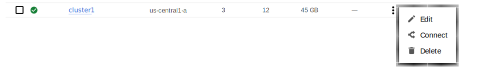
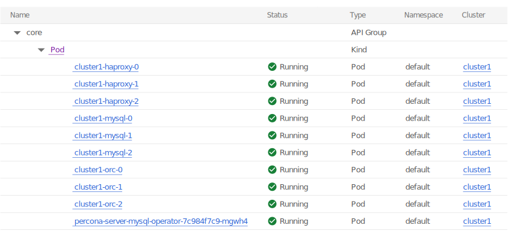
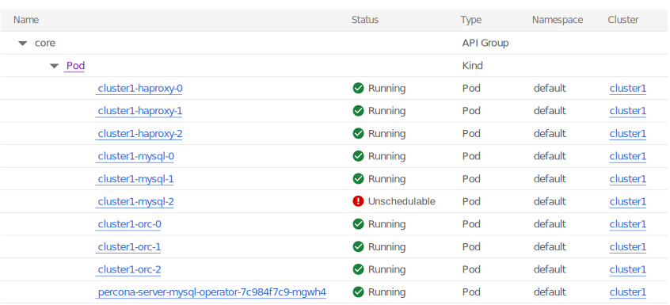
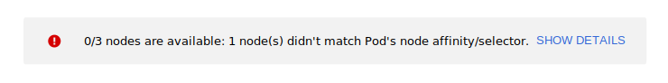

# Install Percona Server for MySQL on Google Kubernetes Engine (GKE)

This guide shows you how to deploy Percona Operator for MySQL on Google
Kubernetes Engine (GKE). The document assumes some experience with the platform.
For more information on the GKE, see the [Kubernetes Engine Quickstart :octicons-link-external-16:](https://cloud.google.com/kubernetes-engine/docs/quickstart).

## Prerequisites

All commands from this guide can be run either in the **Google Cloud shell** or in **your local shell**.

To use *Google Cloud shell*, you need nothing but a modern web browser.

If you would like to use *your local shell*, install the following:

1. [gcloud :octicons-link-external-16:](https://cloud.google.com/sdk/docs/quickstarts). This tool is
    part of the Google Cloud SDK. To install it, select your operating
    system on the [official Google Cloud SDK documentation page :octicons-link-external-16:](https://cloud.google.com/sdk/docs)
    and then follow the instructions.

2. [kubectl :octicons-link-external-16:](https://cloud.google.com/kubernetes-engine/docs/quickstart#choosing_a_shell).
    It is the Kubernetes command-line tool you will use to manage and deploy
    applications. To install the tool, run the following command:

    ```bash
    gcloud auth login
    gcloud components install kubectl
    ```

## Before you start

Check the [System Requirements](System-Requirements.md) to ensure your environment meets the necessary prerequisites.

## Create and configure the GKE cluster

You can configure the settings using the `gcloud` tool. You can run it either in
the [Cloud Shell :octicons-link-external-16:](https://cloud.google.com/shell/docs/quickstart) or in your
local shell (if you have installed Google Cloud SDK locally on the previous
step). The following command will create a cluster named `ps-cluster1`:

```bash
gcloud container clusters create ps-cluster1 --project <project ID> --zone us-central1-a --cluster-version {{ gkerecommended }} --machine-type n1-standard-4 --num-nodes=3
```

!!! note

    You must edit the above command and other command-line statements to replace the `<project ID>` placeholder with your project ID (see available projects with `gcloud projects list` command). You may also be required to edit the *zone location*, which is set to `us-central1-a` in the above example. Other parameters specify that we are creating a cluster with 3 nodes and with machine type of 4 vCPUs.

You may wait a few minutes for the cluster to be generated.

???+ note "When the process is over, you can see it listed in the Google Cloud console"

    Select *Kubernetes Engine* → *Clusters* in the left menu panel:

    

Now you should configure the command-line access to your newly created cluster
to make `kubectl` be able to use it.

In the Google Cloud Console, select your cluster and then click the *Connect*
shown on the above image. You will see the connect statement which configures
the command-line access. After you have edited the statement, you may run the
command in your local shell:

```bash
gcloud container clusters get-credentials ps-cluster1 --zone us-central1-a --project <project name>
```

Finally, use your [Cloud Identity and Access Management (Cloud IAM) :octicons-link-external-16:](https://cloud.google.com/iam)
to control access to the cluster. The following command will give you the
ability to create Roles and RoleBindings:

```bash
kubectl create clusterrolebinding cluster-admin-binding --clusterrole cluster-admin --user $(gcloud config get-value core/account)
```

??? example "Expected output"

    ```{.text .no-copy}
    clusterrolebinding.rbac.authorization.k8s.io/cluster-admin-binding created
    ```

## Install the Operator and deploy your MySQL cluster

1. Deploy the Operator. By default deployment will be done in the `default`
    namespace. If that's not the desired one, you can create a new namespace
    and/or set the context for the namespace as follows (replace the `<namespace name>` placeholder with some descriptive name):

    ```bash
    kubectl create namespace <namespace name>
    kubectl config set-context $(kubectl config current-context) --namespace=<namespace name>
    ```

    At success, you will see the message that `namespace/<namespace name>` was created, and the context (`gke_<project name>_<zone location>_<cluster name>`) was modified.

    Deploy the Operator using the following command:

    ```bash
    kubectl apply -f https://raw.githubusercontent.com/percona/percona-server-mysql-operator/v{{ release }}/deploy/bundle.yaml
    ```

    ??? example "Expected output"

        ```{.text .no-copy}
        customresourcedefinition.apiextensions.k8s.io/perconaservermysqlbackups.ps.percona.com created
        customresourcedefinition.apiextensions.k8s.io/perconaservermysqlrestores.ps.percona.com created
        customresourcedefinition.apiextensions.k8s.io/perconaservermysqls.ps.percona.com created
        serviceaccount/percona-server-mysql-operator created
        role.rbac.authorization.k8s.io/percona-server-mysql-operator-leaderelection created
        role.rbac.authorization.k8s.io/percona-server-mysql-operator created
        rolebinding.rbac.authorization.k8s.io/percona-server-mysql-operator-leaderelection created
        rolebinding.rbac.authorization.k8s.io/percona-server-mysql-operator created
        configmap/percona-server-mysql-operator-config created
        deployment.apps/percona-server-mysql-operator created
        ```

2. The operator has been started, and you can deploy your MySQL cluster:

    ```bash
    kubectl apply -f https://raw.githubusercontent.com/percona/percona-server-mysql-operator/v{{ release }}/deploy/cr.yaml
    ```

    ??? example "Expected output"

        ```{.text .no-copy}
        perconaservermysql.ps.percona.com/ps-cluster1 created
        ```

    !!! note

        This deploys default MySQL cluster configuration.
        Please see [deploy/cr.yaml :octicons-link-external-16:](https://raw.githubusercontent.com/percona/percona-server-MySQL-operator/v{{ release }}/deploy/cr.yaml)
        and [Custom Resource Options](operator.md)
        for the configuration options. You can clone the repository with all
        manifests and source code by executing the following command:

        ```bash
        git clone -b v{{ release }} https://github.com/percona/percona-server-mysql-operator
        ```

        After editing the needed options, apply your modified `deploy/cr.yaml` file as follows:

        ```bash
        kubectl apply -f deploy/cr.yaml
        ```

    The creation process may take some time. When the process is over your
    cluster will obtain the `ready` status. You can check it with the following
    command:

    ```bash
    kubectl get ps
    ```

    ??? example "Expected output"

        ```{.text .no-copy}
        NAME       REPLICATION   ENDPOINT                   STATE   MYSQL   ORCHESTRATOR   HAPROXY   ROUTER   AGE
        ps-cluster1   async         ps-cluster1-haproxy.default   ready   3       3              3                  5m50s
        ```

??? note "You can also track the creation process in Google Cloud console via the Object Browser"

    When the creation process is finished, it will look as follows:

    


## Verifying the cluster operation

It may take ten minutes to get the cluster started. When `kubectl get ps`
command finally shows you the cluster status as `ready`, you can try to connect
to the cluster.



## Troubleshooting

If `kubectl get ps` command doesn't show `ready` status too long, you can 
check the creation process with the `kubectl get pods` command:

```bash
kubectl get pods
```

??? example "Expected output"

    ```text
    NAME                                            READY   STATUS    RESTARTS      AGE
    ps-cluster1-haproxy-0                              2/2     Running   0             44m
    ps-cluster1-haproxy-1                              2/2     Running   0             44m
    ps-cluster1-haproxy-2                              2/2     Running   0             44m
    ps-cluster1-mysql-0                                3/3     Running   0             46m
    ps-cluster1-mysql-1                                3/3     Running   2 (44m ago)   45m
    ps-cluster1-mysql-2                                3/3     Running   2 (42m ago)   43m
    ps-cluster1-orc-0                                  2/2     Running   0             46m
    ps-cluster1-orc-1                                  2/2     Running   0             45m
    ps-cluster1-orc-2                                  2/2     Running   0             44m
    percona-server-mysql-operator-7c984f7c9-mgwh4   1/1     Running   0             47m
    ```

If the command output had shown some errors, you can examine the problematic
Pod with the `kubectl describe <pod name>` command as follows:

```bash
kubectl describe pod ps-cluster1-mysql-2
```

Review the detailed information for `Warning` statements and then correct the
configuration. An example of a warning is as follows:

`Warning  FailedScheduling  68s (x4 over 2m22s)  default-scheduler  0/1 nodes are available: 1 node(s) didn’t match pod affinity/anti-affinity, 1 node(s) didn’t satisfy existing pods anti-affinity rules.`

??? note "Alternatively, you can examine your Pods via the object browser"

    The errors will look as follows:

    

    Clicking the problematic Pod will bring you to the details page with the
    same warning:

    

## Removing the GKE cluster

There are several ways that you can delete the cluster.


You can clean up the cluster with the `gcloud container clusters delete <cluster name> --zone <zone location>` command. The return statement requests your confirmation of the deletion. Type `y` to confirm.

```bash
gcloud container clusters delete ps-cluster1 --zone us-central1-a --project <project ID>
```

The return statement requests your confirmation of the deletion. Type `y` to confirm.

??? note "Also, you can delete your cluster via the Google Cloud console"

    Just click the `Delete` popup menu item in the clusters list:

    

The cluster deletion may take time.

!!! warning

    After deleting the cluster, all data stored in it will be lost!
