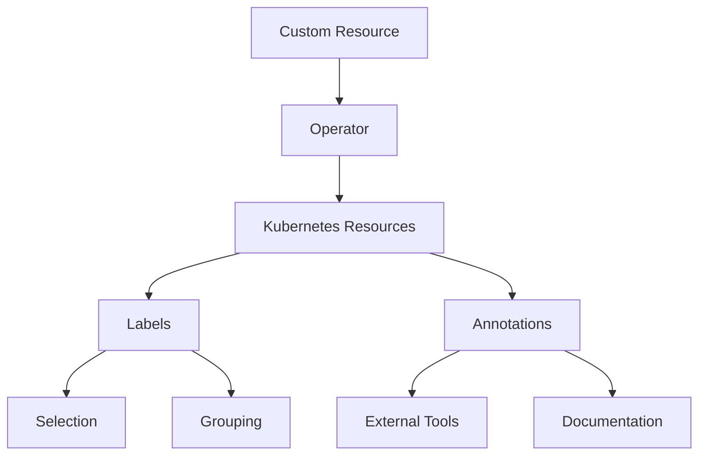
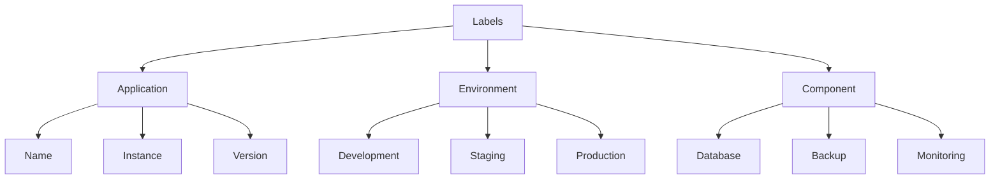

# Working with labels and annotations in Percona Server MySQL Operator

This document provides comprehensive guidance on working with labels and annotations in Percona Server MySQL Operator.

## Understanding label naming conventions

### Using hierarchical namespaces

Follow these conventions for consistent and maintainable labels:

1. **Use hierarchical namespaces**:
   - Format: `domain/component/attribute`
   - Example: `percona.com/mysql/role`

2. **Common label prefixes**:
   - `app.kubernetes.io/` - Application identification
   - `percona.com/` - Percona-specific labels
   - `environment/` - Environment identification

3. **Recommended label keys**:
   ```yaml
   labels:
     app.kubernetes.io/name: "mysql"
     app.kubernetes.io/instance: "cluster1"
     app.kubernetes.io/version: "8.0"
     app.kubernetes.io/component: "database"
     app.kubernetes.io/part-of: "percona-server"
     app.kubernetes.io/managed-by: "percona-server-mysql-operator"
   ```

### Choosing between labels and annotations

Use **Labels** when:

- The information is used for object selection
- The data is used for grouping or filtering
- The information is used by Kubernetes controllers
- The data is used for operational purposes

Use **Annotations** when:

- The information is for external tools
- The information is used for debugging
- The data is used for monitoring configuration

### Avoiding common pitfalls

1. **Over-labeling**:
   - Don't add labels for every possible attribute
   - Focus on labels that provide operational value
   - Avoid redundant or overlapping labels

2. **Inconsistent naming**:
   - Don't mix different naming conventions
   - Don't use different prefixes for similar concepts
   - Don't use different formats for similar attributes

3. **Missing required labels**:
   - Always include the recommended Kubernetes labels
   - Always include the Operator version labels
   - Always include environment identification labels

## Understanding label and annotation flow

### Visualizing the label and annotation flow



### Understanding the label hierarchy



## Troubleshooting common issues

### Resolving label and annotation problems

1. **Labels not being applied**:
   ```bash
   # Check if labels are present
   kubectl get pod <pod-name> --show-labels
   
   # Check if labels are being managed by Operator
   kubectl get ps <cluster-name> -o yaml
   ```

2. **Annotations being removed**:
   ```bash
   # Check if annotation is in ignore list
   kubectl get ps <cluster-name> -o yaml | grep ignoreAnnotations
   
   # Verify annotation is present
   kubectl get pod <pod-name> -o jsonpath='{.metadata.annotations}'
   ```

3. **Version labels missing**:
   ```bash
   # Check Operator version
   kubectl get deployment percona-server-mysql-operator -o jsonpath='{.spec.template.spec.containers[0].image}'
   
   # Verify version labels
   kubectl get pod <pod-name> --show-labels | grep operator-version
   ```

### Following debugging steps

1. **Verify Custom Resource configuration**:
   ```bash
   kubectl get ps <cluster-name> -o yaml
   ```

2. **Check Operator logs**:
   ```bash
   kubectl logs -l app.kubernetes.io/name=percona-server-mysql-operator
   ```

3. **Verify label propagation**:
   ```bash
   # Check all resources with specific label
   kubectl get all -l app.kubernetes.io/name=mysql
   ```

## Managing ignored labels and annotations

### Understanding when to use ignored labels and annotations

1. **Cloud Provider Integration**:
   - When using cloud provider-specific labels
   - When integrating with cloud monitoring tools
   - When using cloud-specific annotations

2. **External Tool Integration**:
   - When using monitoring tool labels
   - When using logging tool annotations
   - When using security tool labels

3. **Custom Automation**:
   - When using custom automation tools
   - When using custom monitoring solutions
   - When using custom backup solutions

### Configuring ignored labels and annotations

1. **Basic Ignore Configuration**:
   ```yaml
   spec:
     ignoreAnnotations:
       - cloud.google.com/
       - monitoring.example.com/
     ignoreLabels:
       - backup.example.com/
       - security.example.com/
   ```

2. **Advanced Ignore Configuration**:
   ```yaml
   spec:
     ignoreAnnotations:
       - cloud.google.com/
       - monitoring.example.com/
       - logging.example.com/
       - backup.example.com/
     ignoreLabels:
       - backup.example.com/
       - security.example.com/
       - monitoring.example.com/
       - logging.example.com/
   ```

### Verifying ignored labels and annotations

1. **Check if labels are being ignored**:
   ```bash
   # Add a test label
   kubectl label pod <pod-name> test.example.com/test=value
   
   # Verify the label persists
   kubectl get pod <pod-name> --show-labels
   ```

2. **Check if annotations are being ignored**:
   ```bash
   # Add a test annotation
   kubectl annotate pod <pod-name> test.example.com/test=value
   
   # Verify the annotation persists
   kubectl get pod <pod-name> -o jsonpath='{.metadata.annotations}'
   ```

### Following best practices for ignored labels and annotations

1. **Documentation**:
   - Document all ignored labels/annotations
   - Explain why each label/annotation is ignored
   - Keep the list of ignored items up to date

2. **Organization**:
   - Group ignored items by purpose
   - Use consistent naming patterns
   - Keep the list as short as possible

3. **Maintenance**:
   - Regularly review ignored items
   - Remove unused ignored items
   - Update ignored items when tools change 