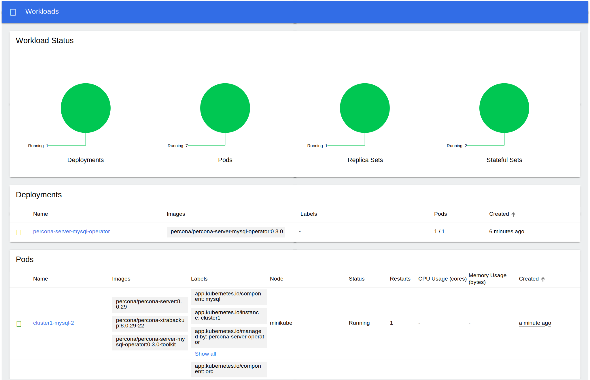

# Install Percona Server for MySQL on Minikube

Installing the Percona Operator for MySQL on [minikube](https://github.com/kubernetes/minikube)
is the easiest way to try it locally without a cloud provider. Minikube runs
Kubernetes on GNU/Linux, Windows, or macOS system using a system-wide
hypervisor, such as VirtualBox, KVM/QEMU, VMware Fusion or Hyper-V. Using it is
a popular way to test the Kubernetes application locally prior to deploying it
on a cloud.

## Prerequisites

To run Percona Operator for MySQL on Minikube you should first of all [install Minikube](https://kubernetes.io/docs/tasks/tools/install-minikube/),
using a way recommended for your system. This includes the installation of
the following three components:

1. kubectl tool,
2. a hypervisor, if it is not already installed,
3. actual Minikube package

After the installation, run `minikube start --memory=4096 --cpus=3`
(parameters increase the virtual machine limits for the CPU cores and memory,
to ensure stable work of the Operator). Being executed, this command will
download needed virtualized images, then initialize and run the
cluster. After Minikube is successfully started, you can optionally run the
Kubernetes dashboard, which visually represents the state of your cluster.
Executing `minikube dashboard` will start the dashboard and open it in your
default web browser.

## Install the Operator and deploy your MySQL cluster

1. Clone the percona-server-mysql-operator repository:

    ```bash
    $ git clone -b v{{ release }} https://github.com/percona/percona-server-mysql-operator
    $ cd percona-server-mysql-operator
    ```

2. Deploy the operator with the following command:

    ```bash
    $ kubectl apply -f deploy/bundle.yaml
    ```

    ??? example "Expected output"

        ```text
        customresourcedefinition.apiextensions.k8s.io/perconaservermysqlbackups.ps.percona.com created
        customresourcedefinition.apiextensions.k8s.io/perconaservermysqlrestores.ps.percona.com created
        customresourcedefinition.apiextensions.k8s.io/perconaservermysqls.ps.percona.com created
        serviceaccount/percona-server-mysql-operator created
        role.rbac.authorization.k8s.io/percona-server-mysql-operator-leaderelection created
        role.rbac.authorization.k8s.io/percona-server-mysql-operator created
        rolebinding.rbac.authorization.k8s.io/percona-server-mysql-operator-leaderelection created
        rolebinding.rbac.authorization.k8s.io/percona-server-mysql-operator created
        configmap/percona-server-mysql-operator-config created
        deployment.apps/percona-server-mysql-operator created
        ```

3. Because minikube runs locally, the Operator will be unable to spread the
    cluster on several nodes. Therefore default ``deploy/cr.yaml`` file should
    be edited to adapt the Operator for the installation on a single computer.
    Set **all occasions** of the `antiAffinityTopologyKey` key to `"none"`.
    When done, apply the updated ``deploy/cr.yaml`` file with the following
    command:

    ```bash
    $ kubectl apply -f deploy/cr.yaml
    ```

    ??? example "Expected output"

        ```text
        perconaservermysql.ps.percona.com/cluster1 created
        ```

    This deploys three Percona Server for MySQL instances and one Orchestrator
    instance. For more configuration options please see `deploy/cr.yaml` and
    [Custom Resource Options](operator.md#operator-custom-resource-options).

    The creation process may take some time. When the process is over your
    cluster will obtain the `ready` status. You can check it with the following
    command:

    ```bash
    $ kubectl get ps
    ```

    ??? example "Expected output"

        ```text
        NAME       REPLICATION   ENDPOINT                   STATE   MYSQL   ORCHESTRATOR   HAPROXY   ROUTER   AGE
        cluster1   async         cluster1-haproxy.default   ready   3       3              3                  5m50s
        ```

    You can also track the progress via the Kubernetes dashboard:

    

## Verify the cluster operation

It may take ten minutes to get the cluster started. When `kubectl get ps`
command finally shows you the cluster status as `ready`, you can try to connect
to the cluster.



