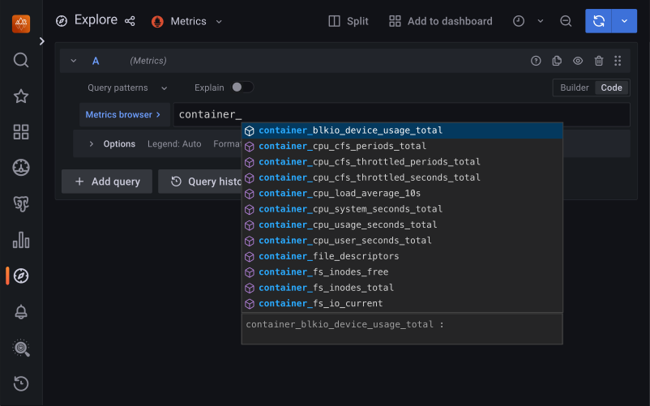
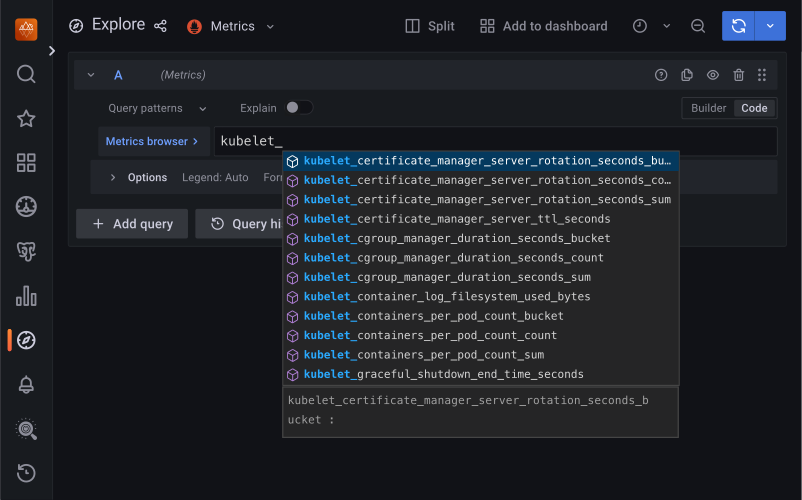

# Monitor Kubernetes 

Monitoring the state of the database is crucial to timely identify and react to performance issues. [Percona Monitoring and Management (PMM) solution enables you to do just that](monitoring.md).

However, the database state also depends on the state of the Kubernetes cluster itself. Hence it’s important to have metrics that can depict the state of the Kubernetes cluster.

This document describes how to set up monitoring of the Kubernetes cluster health. For this setup we used the following tools:

* [PMM server :octicons-link-external-16:](https://docs.percona.com/percona-monitoring-and-management/3/reference/index.html#pmm-server) as the centralized data storage
* [Victoria Metrics Operator :octicons-link-external-16:](https://docs.victoriametrics.com/operator/) as the metrics collector. 

These steps may also apply if you use another Prometheus-compatible storage.

## Considerations

1. In this setup we use [Victoria Metrics kubernetes monitoring stack :octicons-link-external-16:](https://github.com/VictoriaMetrics/helm-charts/tree/master/charts/victoria-metrics-k8s-stack) Helm chart. When customizing the chart's values, consider the following:

    * Since we use the PMM server for monitoring, there is no need to store the data in Victoria Metrics Operator. Therefore, the Victoria Metrics Helm chart is installed with the `vmsingle.enabled` and `vmcluster.enabled` parameters set to `false` in this setup.
    * The Prometheus node exporter is not installed by default since it requires privileged containers with the access to the host file system. If you need the metrics for Nodes, enable the Prometheus node exporter by setting the `prometheus-node-exporter.enabled` flag in the Victoria Metrics Helm chart to `true`.
    * [Check all the role-based access control (RBAC) rules :octicons-link-external-16:](https://helm.sh/docs/topics/rbac/) of the `victoria-metrics-k8s-stack` chart and the dependencies chart, and modify them based on your requirements.

2. This setup is used for a 1:1 mapping from Kubernetes cluster to the PMM server. If you wish to monitor more than one Kubernetes cluster in a single PMM server, provide the unique cluster ID for the `victoria-metrics-k8s-stack` chart. The dashboard must support filtering per Kubernetes cluster. You also need to properly [relabel the metrics :octicons-link-external-16:](https://docs.victoriametrics.com/vmagent.html#relabeling) from the backend.

## Pre-requisites

To set up monitoring of Kubernetes, you need the following:

1. PMM Server up and running. You can run PMM Server in Kubernetes, as a Docker image, a virtual appliance, or on an AWS instance. Please refer to the [official PMM documentation :octicons-link-external-16:](https://docs.percona.com/percona-monitoring-and-management/3/install-pmm/install-pmm-server/index.html) for the installation instructions.

2. [Helm v3 :octicons-link-external-16:](https://docs.helm.sh/using_helm/#installing-helm).
3. [kubectl :octicons-link-external-16:](https://kubernetes.io/docs/tasks/tools/).
4. PMM service account token. The token must have the role **Admin**. Use PMM documentation to [generate a service account with the **Admin** role and token :octicons-link-external-16:](https://docs.percona.com/percona-monitoring-and-management/3/api/authentication.html?h=authe#generate-a-service-account-and-token).

    The token must have the format `glsa_*************************_9e35351b`.

    !!! warning

        When you create a service account token, you can select its lifetime: it can be either a permanent token that never expires or the one with the expiration date. PMM server cannot rotate service account tokens after they expire. So you must take care of reconfiguring PMM Client in this case.

## Procedure

### Prepare your environment

1. Create the Namespace where you want to set up monitoring. The following command creates the Namespace `monitoring-system`. You can specify a different name. In the latter steps, specify your namespace instead of the `<namespace>` placeholder.

    ```bash
    kubectl create namespace monitoring-system
    ```

2. Export the namespace as the environment variable to simplify further configuration

    ```bash
    export NAMESPACE=monitoring-system
    ```


### Install the Victoria Metrics Kubernetes monitoring stack

=== ":material-run-fast: Quick install"

    1. To install the Victoria Metrics Kubernetes monitoring stack with the default parameters, use the quick install command. Replace the following placeholders with your values:

        * `PMM-SERVER-TOKEN` - The [PMM Server service account token](#set-up-authentication-in-pmm-server)
        * `PMM-SERVER-URL` - The URL to access the PMM Server 
        * `UNIQUE-K8s-CLUSTER-IDENTIFIER` - Identifier for the Kubernetes cluster. It can be the name you defined during the cluster creation.

           You should use a unique identifier for each Kubernetes cluster. The use of the same identifier for more than one Kubernetes cluster will result in the conflicts during the metrics collection.

        * `NAMESPACE` - The namespace where the Victoria metrics Kubernetes stack will be installed. If you haven't created the namespace before, it will be created during the command execution.

          We recommend to use a separate namespace like `monitoring-system`.

          ```bash
          curl -fsL  https://raw.githubusercontent.com/Percona-Lab/k8s-monitoring/refs/tags/{{k8s_monitor_tag}}/vm-operator-k8s-stack/quick-install.sh | bash -s -- --api-key <PMM-SERVER-TOKEN> --pmm-server-url <PMM-SERVER-URL> --k8s-cluster-id <UNIQUE-K8s-CLUSTER-IDENTIFIER> --namespace $NAMESPACE
          ```

        !!! note

            The Prometheus node exporter is not installed by default since it requires privileged containers with the access to the host file system. If you need the metrics for Nodes, add the `--node-exporter-enabled` flag as follows:

            ```bash
            curl -fsL  https://raw.githubusercontent.com/Percona-Lab/k8s-monitoring/refs/tags/{{k8s_monitor_tag}}/vm-operator-k8s-stack/quick-install.sh | bash -s -- --api-key <PMM-SERVER-TOKEN> --pmm-server-url <PMM-SERVER-URL> --k8s-cluster-id <UNIQUE-K8s-CLUSTER-IDENTIFIER> --namespace <NAMESPACE> --node-exporter-enabled
            ```

=== ":fontawesome-solid-user-gear: Install manually"

    You may need to customize the default parameters of the Victoria metrics Kubernetes stack.

    * Since we use the PMM Server for monitoring, there is no need to store the data in Victoria Metrics Operator. Therefore, the Victoria Metrics Helm chart is installed with the `vmsingle.enabled` and `vmcluster.enabled` parameters set to `false` in this setup.
    * [Check all the role-based access control (RBAC) rules :octicons-link-external-16:](https://helm.sh/docs/topics/rbac/) of the `victoria-metrics-k8s-stack` chart and the dependencies chart, and modify them based on your requirements.

    #### Set up authentication in PMM Server

    To access the PMM Server resources and perform actions on the server, configure authentication.

    1. Encode the PMM server token with base64.

        === "in Linux"

            ```bash
            echo -n <pmm-token> | base64 --wrap=0
            ````

        === "in macOS"

            ```bash
            echo -n <pmm-token>| base64
            ```

    2. Create the YAML file for the [Kubernetes Secrets :octicons-link-external-16:](https://kubernetes.io/docs/concepts/configuration/secret/) and specify the base64-encoded PMM server token value within. Let's name this file `pmm-api-vmoperator.yaml`.

        ```yaml title="pmm-api-vmoperator.yaml"
        apiVersion: v1
        data:
          api_key: <base-64-encoded-pmm-server-token>
        kind: Secret
        metadata:
          name: pmm-token-vmoperator
          namespace: monitoring-system
        type: Opaque
        ```

    3. Create the Secrets object using the YAML file you created previously.

        ```{.bash data-prompt="$" }
        kubectl apply -f pmm-api-vmoperator.yaml -n $NAMESPACE
        ```

    4. Check that the secret is created. The following command checks the secret for the resource named `pmm-token-vmoperator` (as defined in the `metadata.name` option in the secrets file). If you defined another resource name, specify your value.  

       ```{.bash data-prompt="$" }
       kubectl get secret pmm-token-vmoperator -n $NAMESPACE
       ```

    #### Create a ConfigMap to mount for `kube-state-metrics`

    The [`kube-state-metrics` (KSM) :octicons-link-external-16:](https://github.com/kubernetes/kube-state-metrics) is a simple service that listens to the Kubernetes API server and generates metrics about the state of various objects - Pods, Deployments, Services and Custom Resources.

    To define what metrics the `kube-state-metrics` should capture, create the [ConfigMap :octicons-link-external-16:](https://github.com/kubernetes/kube-state-metrics/blob/main/docs/customresourcestate-metrics.md#configuration) and mount it to a container.

    Use the [example `configmap.yaml` configuration file :octicons-link-external-16:](https://github.com/Percona-Lab/k8s-monitoring/blob/refs/tags/{{k8s_monitor_tag}}/vm-operator-k8s-stack/ksm-configmap.yaml) to create the ConfigMap.

    ```{.bash data-prompt="$" }
    $ kubectl apply -f https://raw.githubusercontent.com/Percona-Lab/k8s-monitoring/refs/tags/{{k8s_monitor_tag}}/vm-operator-k8s-stack/ksm-configmap.yaml -n $NAMESPACE
    ```

    As a result, you have the `customresource-config-ksm` ConfigMap created.

    #### Install the Victoria Metrics Kubernetes monitoring stack

    1. Add the dependency repositories of [victoria-metrics-k8s-stack :octicons-link-external-16:](https://github.com/VictoriaMetrics/helm-charts/blob/master/charts/victoria-metrics-k8s-stack) chart.

        ```{.bash data-prompt="$" }
        $ helm repo add grafana https://grafana.github.io/helm-charts
        $ helm repo add prometheus-community https://prometheus-community.github.io/helm-charts
        ```    

    2. Add the Victoria Metrics Kubernetes monitoring stack repository.

        ```{.bash data-prompt="$" }
        $ helm repo add vm https://victoriametrics.github.io/helm-charts/
        ```    

    3. Update the repositories.

        ```{.bash data-prompt="$" }
        $ helm repo update
        ```    

    4. Install the Victoria Metrics Kubernetes monitoring stack Helm chart. You need to specify the following configuration:

        * the URL to access the PMM server in the `externalVM.write.url` option in the format `<PMM-SERVER-URL>/victoriametrics/api/v1/write`. The URL can contain either the IP address or the hostname of the PMM server.
        * the unique name or an ID of the Kubernetes cluster in the `vmagent.spec.externalLabels.k8s_cluster_id` option. Ensure to set different values if you are sending metrics from multiple Kubernetes clusters to the same PMM Server. 
        * The Namespace must be the same as the Namespace for the Secret and ConfigMap

        ```{.bash data-prompt="$" }
        $ helm install vm-k8s vm/victoria-metrics-k8s-stack \
        -f https://raw.githubusercontent.com/Percona-Lab/k8s-monitoring/refs/tags/{{k8s_monitor_tag}}/vm-operator-k8s-stack/values.yaml \
        --set externalVM.write.url=<PMM-SERVER-URL>/victoriametrics/api/v1/write \
        --set vmagent.spec.externalLabels.k8s_cluster_id=<UNIQUE-CLUSTER-IDENTIFIER/NAME> \
        -n $NAMESPACE
        ```

        To illustrate, say your PMM Server URL is `https://pmm-example.com`, the cluster ID is `test-cluster` and the Namespace is `monitoring-system`. Then the command would look like this:

        ```bash
        helm install vm-k8s vm/victoria-metrics-k8s-stack \
        -f https://raw.githubusercontent.com/Percona-Lab/k8s-monitoring/refs/tags/{{k8s_monitor_tag}}/vm-operator-k8s-stack/values.yaml \
        --set externalVM.write.url=https://pmm-example.com/victoriametrics/api/v1/write \
        --set vmagent.spec.externalLabels.k8s_cluster_id=test-cluster \
        -n monitoring-system
        ```

### Validate the successful installation

Check the Pods. 

```{.bash data-prompt="$" }
$ kubectl get pods -n $NAMESPACE
```

??? example "Sample output" 

    ```{.text .no-copy}
    NAME                                                        READY   STATUS    RESTARTS   AGE
    vm-k8s-grafana-5f6bdb8c7c-d5bw5                             3/3     Running   0          90m
    vm-k8s-kube-state-metrics-57c5977d4f-6jtbj                  1/1     Running   0          81m
    vm-k8s-prometheus-node-exporter-kntfk                       1/1     Running   0          90m
    vm-k8s-prometheus-node-exporter-mjrvj                       1/1     Running   0          90m
    vm-k8s-prometheus-node-exporter-v98c8                       1/1     Running   0          90m
    vm-k8s-victoria-metrics-operator-6b7f4f786d-sctp8           1/1     Running   0          90m
    vmagent-vm-k8s-victoria-metrics-k8s-stack-fbc86c9db-rz8wk   2/2     Running   0          90m    
    ```

What Pods are running depends on the configuration chosen in values used while installing `victoria-metrics-k8s-stack` chart.

## Verify metrics capture

1. Connect to the PMM server.
2. Click **Explore** and switch to the **Code** mode.
3. Check that the required metrics are captured, type the following in the Metrics browser dropdown:

    * [cadvisor :octicons-link-external-16:](https://github.com/google/cadvisor/blob/master/docs/storage/prometheus.md):

       

    * kubelet:

       

    * [kube-state-metrics :octicons-link-external-16:](https://github.com/kubernetes/kube-state-metrics/tree/main/docs) metrics that also include Custom resource metrics for the Operator and database deployed in your Kubernetes cluster:

      


## Uninstall Victoria metrics Kubernetes stack

To remove Victoria metrics Kubernetes stack used for Kubernetes cluster monitoring, use the cleanup script. By default, the script removes all the [Custom Resource Definitions(CRD) :octicons-link-external-16:](https://kubernetes.io/docs/tasks/extend-kubernetes/custom-resources/custom-resource-definitions/) and Secrets associated with the Victoria metrics Kubernetes stack. To keep the CRDs, run the script with the `--keep-crd` flag.

=== ":material-file-remove-outline: Remove CRDs"

    Replace the `<NAMESPACE>` placeholder with the namespace you specified during the Victoria metrics Kubernetes stack installation: 

    ```{.bash data-prompt="$" }
    $ bash <(curl -fsL https://raw.githubusercontent.com/Percona-Lab/k8s-monitoring/refs/tags/{{k8s_monitor_tag}}/vm-operator-k8s-stack/cleanup.sh) --namespace <NAMESPACE>
    ```

=== ":material-file-outline: Keep CRDs"

    Replace the `<NAMESPACE>` placeholder with the namespace you specified during the Victoria metrics Kubernetes stack installation: 

    ```{.bash data-prompt="$" }
    $ bash <(curl -fsL https://raw.githubusercontent.com/Percona-Lab/k8s-monitoring/refs/tags/{{k8s_monitor_tag}}/vm-operator-k8s-stack/cleanup.sh) --namespace <NAMESPACE> --keep-crd 
    ```

Check that the Victoria metrics Kubernetes stack is deleted:

```{.bash data-prompt="$" }
helm list -n $NAMESPACE
```

The output should provide the empty list.

If you face any issues with the removal, uninstall the stack manually:

```{.bash data-prompt="$" }
helm uninstall vm-k8s-stack -n < namespace> 
```
