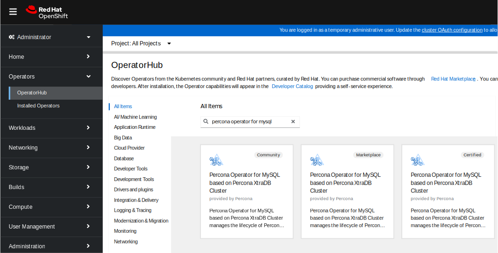
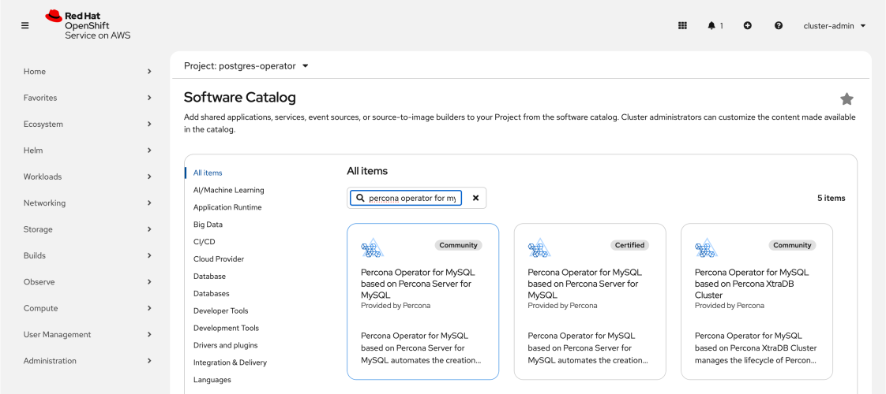
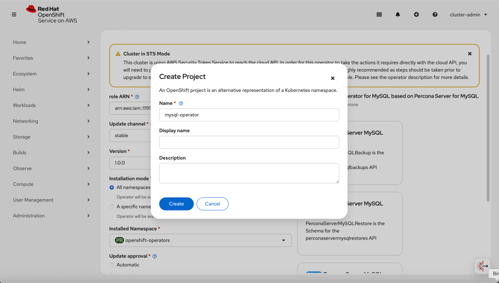
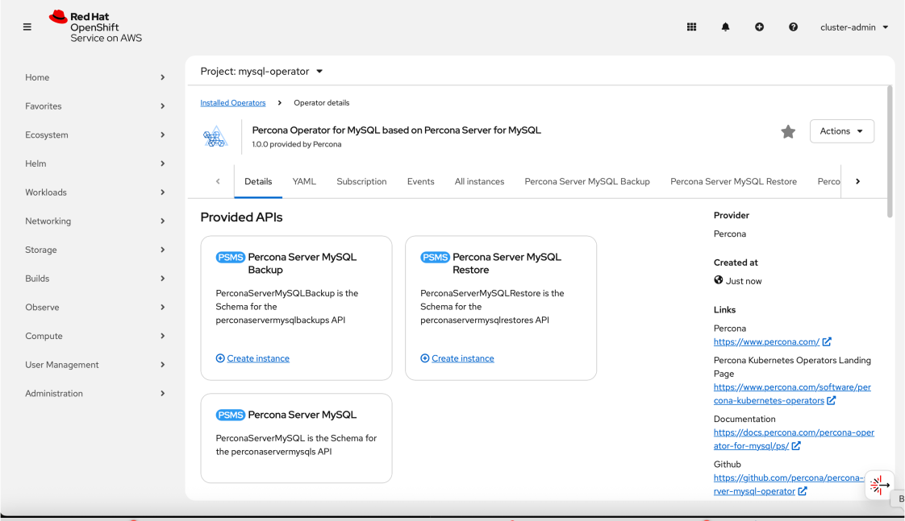

# Install Percona Server for MySQL on OpenShift



You can install Percona Operator for MySQL on OpenShift clusters. This makes it portable across hybrid clouds and it fully supports the Red Hat OpenShift lifecycle.

To install Percona Server for MySQL on OpenShift means:

* Install Percona Operator for MySQL,
* Install Percona Server for MySQL using the Operator.

## Prerequisites

- OpenShift cluster with administrative access
- `oc` command-line tool installed
- Git client installed

## Before you start

Check the [System Requirements](System-Requirements.md) to ensure your environment meets the necessary prerequisites.

You can install Percona Operator for MySQL on OpenShift using either:

- The [Operator Lifecycle Manager :octicons-link-external-16:](https://docs.redhat.com/en/documentation/openshift_container_platform/4.2/html/operators/understanding-the-operator-lifecycle-manager-olm#olm-overview_olm-understanding-olm) web interface 
- The command-line interface

Choose the method that best suits your needs. The web interface is recommended for beginners, while the CLI method offers more control and automation capabilities.

## Install the Operator via the Operator Lifecycle Manager (OLM)

Operator Lifecycle Manager (OLM) is a part of the [Operator Framework :octicons-link-external-16:](https://github.com/operator-framework) that allows you to install, update, and manage the Operators lifecycle on the OpenShift platform via the web interface.

This tutorial provides guidelines for OpenShift v4.20. Follow closely the requirements for your OpenShift version.

### Prerequisites

Before you start, ensure you have the following:

1. You can log in to the OpenShift console
2. You have the ARN role assigned to your OLM user (for OpenShift 4.20).

### Install the Operator Deployment

Follow these steps to deploy the Operator and Percona Server for MySQL cluster:

1. Login to the OpenShift console.
2. Navigate to the Ecosystem -> Software Catalog.
3. Search for "Percona Operator for MySQL", select "Percona Operator for MySQL based on Percona Server for MySQL". You may need to change the project for your user:

    

4. Then click "Continue", and "Install".
    
    

5. A new page opens where you choose the Operator version and the Namespace / OpenShift project you would like to install the Operator into. You can create a namespace (an OpenShift project) right away by clicking the **Create Project** and filling in project details like name, display name and description.
     
     For OpenShift 4.20, you also need to specify the ARN role assigned to your user.

6. Click "Install"

    

You can track the install process on the Installed Operators page. The Operator should report the **Succeeded** status.

### Deploy Percona Server for MySQL

Now you can deploy Percona Server for MySQL

1. Click the Operator you installed. 
2. On the Details page, find the `PerconaServerMySQL` Custom Resource
3. Click "Create instance"
4. Edit the Custom Resource manifest to fine-tune your cluster configuration. Refer to [Custom Resource reference](operator.md) for the description of available options
5. Click "Create"

     

6. Upon successful installation, you should see the "Ready" status for the database cluster.
    
    

## Install the Operator via the command-line interface

The following steps install the latest version of the Operator with default parameters. To install a specific version, replace the `v{{ release }}` tag with your value. See the full list of tags [in the Operator repository :octicons-link-external-16:](https://github.com/percona/percona-server-mysql-operator/tags) on GitHub.

To install the Operator with customized parameters, see [Install Percona Operator for MySQL with customized parameters](custom-install.md).

Choose the approach that fits your needs:

* [**Quick install**](#quick-install) — Apply a single bundle file. Use this when you want to get started quickly with default settings.
* [**Step-by-step install**](#step-by-step-installation) — Run each installation step separately. Use this when
 you want more control over the installation process or you need to customize the installation.

### Quick install

1. Clone the `percona-server-mysql-operator` repository and change the directory to `percona-server-mysql-operator`. 

    !!! important

        You must specify the correct branch with the `-b` option while cloning the code on this step. Please be careful.

    ```bash
    git clone -b v{{ release }} https://github.com/percona/percona-server-mysql-operator
    cd percona-server-mysql-operator
    ```

2. Create the Kubernetes namespace for your cluster. It is a good practice to isolate workloads in Kubernetes by installing the Operator in a custom namespace. Replace the `<namespace>` placeholder with your value.

    ```bash
    oc create namespace <namespace>
    ```

    ??? example "Expected output"

        ``` {.text .no-copy}
        namespace/<namespace> was created
        ```

3. A `bundle.yaml` is a Kubernetes manifest that packages Operator metadata and resources. By applying this file, Kubernetes creates the Custom Resource Definition, sets up role-based access control and installs the Operator in one single action. Replace the `<namespace>` placeholder with your value:
   
    ```{.bash data-prompt="$" }
    oc apply --server-side -f deploy/bundle.yaml -n <namespace>
    ```

    ??? example "Expected output"

        ```{.text .no-copy}
        customresourcedefinition.apiextensions.k8s.io/perconaservermysqlbackups.ps.percona.com serverside-applied
        customresourcedefinition.apiextensions.k8s.io/perconaservermysqlrestores.ps.percona.com serverside-applied
        customresourcedefinition.apiextensions.k8s.io/perconaservermysqls.ps.percona.com serverside-applied
        serviceaccount/percona-server-mysql-operator serverside-applied
        role.rbac.authorization.k8s.io/percona-server-mysql-operator-leaderelection serverside-applied
        role.rbac.authorization.k8s.io/percona-server-mysql-operator serverside-applied
        rolebinding.rbac.authorization.k8s.io/percona-server-mysql-operator serverside-applied
        rolebinding.rbac.authorization.k8s.io/percona-server-mysql-operator-leaderelection serverside-applied
        configmap/percona-server-mysql-operator-config serverside-applied
        deployment.apps/percona-server-mysql-operator serverside-applied
        ```

### Step-by-step installation

This section splits the installation flow into separate steps giving you more control over the process.

#### Step 1: Clone the repository

Use the following commands to clone the `percona-server-mysql-operator` repository and change the directory to `percona-server-mysql-operator`. 

!!! important

    You must specify the correct branch with the `-b` option while cloning the code on this step. Please be careful.

```bash
git clone -b v{{ release }} https://github.com/percona/percona-server-mysql-operator
cd percona-server-mysql-operator
```

#### Step 2: Create the Custom Resource Definition

At this step you must create the Custom Resource Definition for Percona Operator for MySQL from the `deploy/crd.yaml` file.

The Custom Resource Definition extends the standard set of resources which Kubernetes "knows" about with new items.

You create the Custom Resource Definition only once. It is not bound to a specific namespace and all other deployments will use this Custom Resource Definition. 

Use the following command to create the Custom Resource Definition:

```bash
oc apply --server-side -f deploy/crd.yaml
```

!!! warning

    This step requires cluster-admin privileges. If you're using a non-privileged user, you'll need to set up additional permissions.

#### Step 3: (optional) Set up user permissions 

If you're using a non-privileged user, grant the required permissions by applying the following clusterrole:

```bash
oc create clusterrole ps-admin --verb="*" --resource=perconaservermysqls.ps.percona.com,perconaservermysqls.ps.percona.com/status,perconaservermysqlbackups.ps.percona.com,perconaservermysqlbackups.ps.percona.com/status,perconaservermysqlrestores.ps.percona.com,perconaservermysqlrestores.ps.percona.com/status
oc adm policy add-cluster-role-to-user ps-admin <some-user>
```

If you have a [cert-manager  
    :octicons-link-external-16:](https://
    docs.cert-manager.io/en/release-0.8/
    getting-started/install/openshift.
    html) installed, add these permissions to manage certificates with a 
    non-privileged user:

```bash
oc create clusterrole cert-admin --verb="*" --resource=issuers.certmanager.k8s.io,certificates.certmanager.k8s.io
oc adm policy add-cluster-role-to-user cert-admin <some-user>
```

#### Step 4: Create a project

A project in OpenShift corresponds to a Kubernetes namespace. When you create a new project, you isolate workloads in it. 

```bash
oc new-project ps
```

??? example "Sample output"

    Now using project "ps" on server "https://api.openshift-4-15-my-cluster.example.com:6443".

The command automatically sets context to this project so that all further resources are created in it.

#### Step 5: Configure RBAC

Role-Based Access Control (RBAC) manages resource access in OpenShift. The Operator needs specific permissions to run Percona Server for MySQL properly. These permissions are defined within roles. 

```bash
oc apply -f deploy/rbac.yaml
```

#### Step 6: Deploy the Operator

Now you can deploy the Operator with the following command:

```bash
oc apply -f deploy/operator.yaml
```

### Install Percona Server for MySQL

After installing the Operator, you can deploy Percona Server for MySQL. This section guides you through the process of setting up secrets, certificates, and creating your first cluster.

#### Step 1: Configure secrets (optional)

By default, the Operator generates users Secrets automatically, so you don't have to do anything. Yet if you wish to use your own Secrets, here's how:

1. Edit the `deploy/secrets.yaml` file to set up your MySQL users and passwords:

    ```yaml
    apiVersion: v1
    kind: Secret
    metadata:
      name: my-cluster-secrets
    type: Opaque
    stringData:
      root: your-root-password
      xtrabackup: your-xtrabackup-password
      monitor: your-monitor-password
      clustercheck: your-clustercheck-password
      proxyadmin: your-proxyadmin-password
      pmmserver: your-pmm-server-password
    ```

2. Apply the secrets:

    ```bash
    oc create -f deploy/secrets.yaml
    ```

#### Step 2: Configure certificates (optional)

The Operator handles certificate generation automatically so don't have to do anything. However, if you need custom certificates:

1. Generate your certificates
2. Create a secret with your certificates
3. Reference the secret in your cluster configuration

See [TLS Configuration](TLS.md) for detailed instructions.

#### Step 3: Deploy the database cluster

1. To deploy Percona Server for MySQL cluster means to create a Custom Resource for it in OpenShift. This Custom Resource uses the Percona Server for MySQL Operator, which automates the deployment, scaling, and management of MySQL clusters.

    The Custom Resource is described by the `deploy/cr.yaml` file. So to create it, you need to apply this file as follows:


    ```bash
    oc apply -f deploy/cr.yaml
    ```

    ??? example "Expected output"

        ```{.text .no-copy}
        perconaservermysql.ps.percona.com/ps-cluster1 created
        ```

2. It may take up to 10 minutes to complete the cluster deployment. Use this command to monitor the deployment:

    ```bash
    oc get ps
    ```

    ??? example "Expected output"

        ``` {.text .no-copy}
        NAME       REPLICATION         ENDPOINT                    STATE   MYSQL   ORCHESTRATOR   HAPROXY   ROUTER   AGE
        ps-cluster1   group-replication   ps-cluster1-haproxy.nastena1   ready   3                      3                  6m
        ```

    The `ready` status indicates that your cluster is fully operational.
    

## Verify the cluster operation



## Next steps

[Configure Backup and Restore](backups.md){.md-button}
[Set up monitoring](monitoring.md){.md-button}
[Scale your cluster](scaling.md){.md-button}
