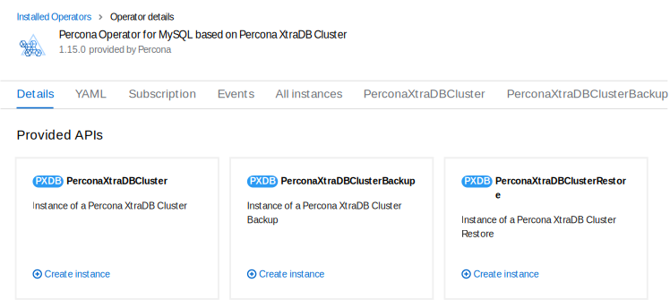

# Install Percona Server for MySQL on OpenShift



You can install Percona Operator for MySQL on OpenShift clusters. This makes it portable across hybrid clouds and it fully supports the Red Hat OpenShift lifecycle.

To install Percona Server for MySQL on OpenShift means:

* Install Percona Operator for MySQL,
* Install Percona Server for MySQL using the Operator.

## Prerequisites

- OpenShift cluster with administrative access
- `oc` command-line tool installed
- Git client installed

<!-- ## Installation options

You can install Percona Operator for MySQL on OpenShift using either:

- The [Operator Lifecycle Manager :octicons-link-external-16:](https://docs.redhat.com/en/documentation/openshift_container_platform/4.2/html/operators/understanding-the-operator-lifecycle-manager-olm#olm-overview_olm-understanding-olm) web interface 
- The command-line interface

Choose the method that best suits your needs. The web interface is recommended for beginners, while the CLI method offers more control and automation capabilities.

## Install the Operator via the Operator Lifecycle Manager (OLM)

Operator Lifecycle Manager (OLM) is a part of the [Operator Framework :octicons-link-external-16:](https://github.com/operator-framework) that allows you to install, update, and manage the Operators lifecycle on the OpenShift platform.

### Step 1: Access OperatorHub

1. Login to the OLM
2. Navigate to the OperatorHub page
3. Search for "Percona Operator for MySQL", select "Percona Operator for MySQL based on Percona Server for MySQL"
4. Click "Install"


### Step 2: Configure the installation

1. Select the Operator version
2. Choose the target namespace: a default one or your custom one. You can create a namespace (an OpenShift project) right away by clicking the **Create Project** and filling in project details like name, display name and description.
3. Click "Install"


You can track the install process on the Installed Operators page. The Operator should report the **Succeeded** status.

### Step 3: Deploy Percona Server for MySQL

Now you can deploy Percona Server for MySQL

1. Click the Operator you installed. 
2. On the Details page, find the `PerconaServerMySQL` Custom Resource
3. Click "Create instance"
4. Edit the Custom Resource manifest to fine-tune your cluster configuration. Refer to [Custom Resource reference](operator.md) for the description of available options
5. Click "Create"

 -->

## Install the Operator via the command-line interface

To get started quickly, choose the [Quick install](#quick-install) option. This way you deploy the Operator with a single command. 

If you want more control over the installation process, jump to the [Step-by-step installation](#step-by-step-installation)

### Quick install

1. Clone the `percona-server-mysql-operator` repository and change the directory to `percona-server-mysql-operator`. 

    !!! important

        You must specify the correct branch with the `-b` option while cloning the code on this step. Please be careful.

    ``` {.bash data-prompt="$" }
    $ git clone -b v{{ release }} https://github.com/percona/percona-server-mysql-operator
    $ cd percona-server-mysql-operator
    ```

2. Create the Kubernetes namespace for your cluster. It is a good practice to isolate workloads in Kubernetes by installing the Operator in a custom namespace. Replace the `<namespace>` placeholder with your value.

    ``` {.bash data-prompt="$" }
    $ oc create namespace <namespace>
    ```

    ??? example "Expected output"

        ``` {.text .no-copy}
        namespace/<namespace> was created
        ```

3. A `bundle.yaml` is a Kubernetes manifest that packages Operator metadata and resources. By applying this file, Kubernetes creates the Custom Resource Definition, sets up role-based access control and installs the Operator in one single action. Replace the `<namespace>` placeholder with your value:
   
    ```{.bash data-prompt="$" }
    $ oc apply --server-side -f deploy/bundle.yaml -n <namespace>
    ```

    ??? example "Expected output"

        ```{.text .no-copy}
        customresourcedefinition.apiextensions.k8s.io/perconaservermysqlbackups.ps.percona.com serverside-applied
        customresourcedefinition.apiextensions.k8s.io/perconaservermysqlrestores.ps.percona.com serverside-applied
        customresourcedefinition.apiextensions.k8s.io/perconaservermysqls.ps.percona.com serverside-applied
        serviceaccount/percona-server-mysql-operator serverside-applied
        role.rbac.authorization.k8s.io/percona-server-mysql-operator-leaderelection serverside-applied
        role.rbac.authorization.k8s.io/percona-server-mysql-operator serverside-applied
        rolebinding.rbac.authorization.k8s.io/percona-server-mysql-operator serverside-applied
        rolebinding.rbac.authorization.k8s.io/percona-server-mysql-operator-leaderelection serverside-applied
        configmap/percona-server-mysql-operator-config serverside-applied
        deployment.apps/percona-server-mysql-operator serverside-applied
        ```

### Step-by-step installation

This section splits the installation flow into separate steps giving you more control over the process.

#### Step 1: Clone the repository

Use the following commands to clone the `percona-server-mysql-operator` repository and change the directory to `percona-server-mysql-operator`. 

!!! important

    You must specify the correct branch with the `-b` option while cloning the code on this step. Please be careful.

``` {.bash data-prompt="$" }
$ git clone -b v{{ release }} https://github.com/percona/percona-server-mysql-operator
$ cd percona-server-mysql-operator
```

#### Step 2: Create the Custom Resource Definition

At this step you must create the Custom Resource Definition for Percona Operator for MySQL from the `deploy/crd.yaml` file.

The Custom Resource Definition extends the standard set of resources which Kubernetes "knows" about with new items.

You create the Custom Resource Definition only once. All other deployments will use this Custom Resource Definition. 

Use the following command to create the Custom Resource Definition:

``` {.bash data-prompt="$" }
$ oc apply --server-side -f deploy/crd.yaml
```

!!! warning

    This step requires cluster-admin privileges. If you're using a non-privileged user, you'll need to set up additional permissions.

#### Step 3: (optional) Set up user permissions 

If you're using a non-privileged user, grant the required permissions by applying the following clusterrole:

``` {.bash data-prompt="$" }
$ oc create clusterrole psmdb-admin --verb="*" --resource=perconaserverMySQLs.psmdb.percona.com,perconaserverMySQLs.psmdb.percona.com/status,perconaserverMySQLbackups.psmdb.percona.com,perconaserverMySQLbackups.psmdb.percona.com/status,perconaserverMySQLrestores.psmdb.percona.com,perconaserverMySQLrestores.psmdb.percona.com/status
$ oc adm policy add-cluster-role-to-user psmdb-admin <some-user>
```

If you have a [cert-manager  
    :octicons-link-external-16:](https://
    docs.cert-manager.io/en/release-0.8/
    getting-started/install/openshift.
    html) installed, add these permissions to manage certificates with a 
    non-privileged user:

``` {.bash data-prompt="$" }
$ oc create clusterrole cert-admin --verb="*" --resource=iissuers.certmanager.k8s.io,certificates.certmanager.k8s.io
$ oc adm policy add-cluster-role-to-user cert-admin <some-user>
```

#### Step 4: Create a project

A project in OpenShift corresponds to a Kubernetes namespace. When you create a new project, you isolate workloads in it. 

``` {.bash data-prompt="$" }
$ oc new-project ps
```

??? example "Sample output"

    Now using project "ps" on server "https://api.openshift-4-15-my-cluster.example.com:6443".

The command automatically sets context to this project so that all further resources are created in it.

#### Step 5: Configure RBAC

Role-Based Access Control (RBAC) manages resource access in OpenShift. The Operator needs specific permissions to run Percona Server for MySQL properly. These permissions are defined within roles. 

``` {.bash data-prompt="$" }
$ oc apply -f deploy/rbac.yaml
```

#### Step 6: Deploy the Operator

Now you can deploy the Operator with the following command:

``` {.bash data-prompt="$" }
$ oc apply -f deploy/operator.yaml
```

## Install Percona Server for MySQL

After installing the Operator, you can deploy Percona Server for MySQL. This section guides you through the process of setting up secrets, certificates, and creating your first cluster.

### Step 1: Configure secrets (optional)

By default, the Operator generates users Secrets automatically, so you don't have to do anything. Yet if you wish to use your own Secrets, here's how:

1. Edit the `deploy/secrets.yaml` file to set up your MySQL users and passwords:

```yaml
apiVersion: v1
kind: Secret
metadata:
  name: my-cluster-secrets
type: Opaque
stringData:
  root: your-root-password
  xtrabackup: your-xtrabackup-password
  monitor: your-monitor-password
  clustercheck: your-clustercheck-password
  proxyadmin: your-proxyadmin-password
  pmmserver: your-pmm-server-password
```

2. Apply the secrets:

``` {.bash data-prompt="$" }
$ oc create -f deploy/secrets.yaml
```

### Step 2: Configure certificates (optional)

The Operator handles certificate generation automatically so don't have to do anything. However, if you need custom certificates:

1. Generate your certificates
2. Create a secret with your certificates
3. Reference the secret in your cluster configuration

See [TLS Configuration](TLS.md) for detailed instructions.

### Step 3: Deploy the database cluster

1. To deploy Percona Server for MySQL cluster means to create a Custom Resource for it in OpenShift. This Custom Resource uses the Percona Server for MySQL Operator, which automates the deployment, scaling, and management of MySQL clusters.

    The Custom Resource is described by the `deploy/cr.yaml` file. So to create it, you need to apply this file as follows:


    ```{.bash data-prompt="$" }
    $ oc apply -f deploy/cr.yaml
    ```

    ??? example "Expected output"

        ```{.text .no-copy}
        perconaservermysql.ps.percona.com/cluster1 created
        ```

2. It make take up to 10 minutes to complete the cluster deployment. Use this command to monitor the deployment:

    ``` {.bash data-prompt="$" }
    $ oc get ps
    ```

    ??? example "Expected output"

        ``` {.text .no-copy}
        NAME       REPLICATION         ENDPOINT                    STATE   MYSQL   ORCHESTRATOR   HAPROXY   ROUTER   AGE
        cluster1   group-replication   cluster1-haproxy.nastena1   ready   3                      3                  6m
        ```

    The `ready` status indicates that your cluster is fully operational.
    

## Verify the cluster operation



## Next steps

[Configure Backup and Restore](backups.md){.md-button}
[Set up monitoring](monitoring.md){.md-button}
[Scale your cluster](scaling.md){.md-button}
