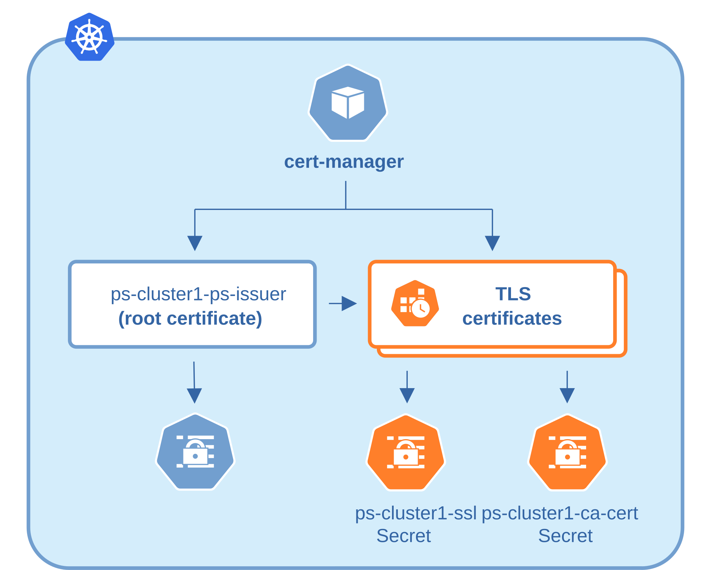

# Configure TLS using cert-manager

## About the cert-manager

The [cert-manager :octicons-link-external-16:](https://cert-manager.io/) is a Kubernetes certificate management controller which is widely used to automate the management and issuance of TLS certificates. It is community-driven and open source.

When the Operator creates a database cluster, it checks whether cert-manager is installed and whether you have already provided a TLS Secret. If cert-manager is available and you have not set a custom Secret, the Operator requests certificates from cert-manager, stores them in Kubernetes Secrets, and uses those Secrets for TLS. cert-manager then manages issuance and renewal.

You can use cert-manager in these ways:

* **Operator-managed issuers (default)** — The Operator creates a namespace-scoped `Issuer` and a local self-signed CA in the database namespace. It then requests a leaf TLS certificate from that issuer. You do not need a separate certificate issuer to get started.

* **Your existing issuer** — Point the Operator at a cert-manager `Issuer` or `ClusterIssuer` that your platform already manages (for example, a corporate CA). Certificates are then signed and renewed under your organization's PKI policies. Percona Server for MySQL requires all certificates in a cluster to come from the same CA.

If cert-manager is not installed or not ready and you have not set `tls.issuerConf`, the Operator falls back to its built-in certificate generation.



See [Transport Layer Security (TLS)](TLS.md) for a comparison of cert-manager integration with manual certificate generation.

## Prerequisites

To use cert-manager with the Operator, ensure the following:

1. You have deployed the Operator. Check if it runs with `kubectl get deploy -n <namespace>`.
2. Your Custom Resource does **not** already include a user-provided TLS Secret in [`sslSecretName`](operator.md#sslsecretname). If that Secret exists and was created by you, the Operator uses it and does not create cert-manager resources.

## Install the cert-manager

The cert-manager requires its own namespace. By default, this is the `cert-manager` namespace.

=== "with kubectl"

    ```bash
    kubectl apply -f https://github.com/cert-manager/cert-manager/releases/download/v{{ certmanagerrecommended }}/cert-manager.yaml
    ```

    This creates the dedicated `cert-manager` namespace and installs cert-manager Deployments, Pods, and Services. It also creates cluster-wide resources such as Custom Resource Definitions and RBAC so you can use cert-manager in any namespace.

=== "with Helm"

    1. Add the Helm chart and update the repositories:

        ```bash
        helm repo add jetstack https://charts.jetstack.io --force-update
        helm repo update
        ```

    2. Install cert-manager with default parameters:

        ```bash
        helm install cert-manager jetstack/cert-manager \
          --namespace cert-manager \
          --create-namespace \
          --version v{{ certmanagerrecommended }} \
          --set crds.enabled=true
        ```

Verify that cert-manager is running:

```bash
kubectl get pods -n cert-manager
```

??? example "Expected output"

    ```{.text .no-copy}
    NAME                                       READY   STATUS    RESTARTS   AGE
    cert-manager-7d59dd4888-tmjqq              1/1     Running   0          3m8s
    cert-manager-cainjector-85899d45d9-8ncw9   1/1     Running   0          3m8s
    cert-manager-webhook-84fcdcd5d-697k4       1/1     Running   0          3m8s
    ```

At this point you are ready to [deploy a Percona Server for MySQL cluster](kubernetes.md).

See the sections below for how you can fine-tune the Operator and cert-manager when managing TLS for your cluster:

## Operator-managed namespace-scoped issuers (default)

Once you create the database with the Operator and cert-manager is running, the Operator automatically creates:

* a self-signed CA `Issuer` (`<cluster-name>-ps-ca-issuer`) and CA `Certificate` (`<cluster-name>-ca-cert`) in the database namespace,
* a signing `Issuer` (`<cluster-name>-ps-issuer`) that references the CA,
* a leaf TLS `Certificate` (`<cluster-name>-ssl`) whose Secret is stored as [`sslSecretName`](operator.md#sslsecretname). The default name is `<cluster-name>-ssl`.

cert-manager issues short-lived certificates and renews them on schedule. The default certificate duration is 90 days. The CA certificate is valid for 1 year.

You do not set `tls.issuerConf` for this mode.

## Use an existing ClusterIssuer

!!! note "Version added: 1.3.0"

If your cluster already runs cert-manager with a cluster-wide issuer, such as Let's Encrypt, Smallstep, or an internal CA, you can configure the Operator to request Percona Server for MySQL certificates from that issuer instead of creating its own CA chain.

The Operator does not create or manage `ClusterIssuer` resources. You must create the `ClusterIssuer` first, then reference it in the Custom Resource.

### Grant the Operator permission to read ClusterIssuers

The Operator's default RBAC covers namespace-scoped `Issuer` and `Certificate` objects only. It does not grant access to cluster-scoped `ClusterIssuer` resources. Grant the Operator ServiceAccount permission to get, list, and watch `ClusterIssuer` objects before you reference one.

Create a `ClusterRole` and `ClusterRoleBinding`. Replace the placeholders with your `ClusterIssuer` name, the Operator ServiceAccount name and the namespace where the Operator is deployed. The following example uses the default ServiceAccount name `percona-server-mysql-operator`:

```yaml title="clusterissuer-rbac.yaml"
apiVersion: rbac.authorization.k8s.io/v1
kind: ClusterRole
metadata:
  name: <cluster-issuer-name>-reader
rules:
- apiGroups: ["cert-manager.io"]
  resources: ["clusterissuers"]
  verbs: ["get", "list", "watch"]
---
apiVersion: rbac.authorization.k8s.io/v1
kind: ClusterRoleBinding
metadata:
  name: <cluster-issuer-name>-reader-<operator-namespace>
roleRef:
  apiGroup: rbac.authorization.k8s.io
  kind: ClusterRole
  name: <cluster-issuer-name>-reader
subjects:
- kind: ServiceAccount
  name: <operator-service-account>
  namespace: <operator-namespace>
```

Apply the manifest:

```bash
kubectl apply -f clusterissuer-rbac.yaml
```

You need this extra RBAC for both [namespace-scoped and cluster-wide](cluster-wide.md) Operator installations.

### Configure the Custom Resource

Edit the `deploy/cr.yaml` and set `tls.issuerConf` to the existing `ClusterIssuer`:

```yaml
spec:
  tls:
    issuerConf:
      name: my-org-issuer        # name of your existing ClusterIssuer
      kind: ClusterIssuer
      group: cert-manager.io
```

Replace `my-org-issuer` with the name of your existing `ClusterIssuer`.

When you deploy the cluster, the Operator creates a `Certificate` resource that references your `ClusterIssuer`. cert-manager signs the resulting Secret. The Operator does not create a parallel CA or overwrite your issuer.

If the `ClusterIssuer` does not exist, the Operator fails reconciliation and logs an error asking you to check `.spec.tls.issuerConf`. If you point an already-working cluster at a `ClusterIssuer` that doesn't exist, the Operator leaves the existing `Certificate` untouched.

You can also add `tls.issuerConf` to a running cluster. The Operator updates the existing `Certificate` to use your `ClusterIssuer`.

## Use an existing namespace-scoped Issuer

To use a cert-manager `Issuer` that already exists in the database namespace, set [`tls.issuerConf.name`](operator.md#tlsissuerconfname) to that issuer's name. You can leave `kind` at the default value (`Issuer`).

```yaml
spec:
  tls:
    issuerConf:
      name: my-org-issuer        # name of your existing Issuer
      kind: Issuer
      group: cert-manager.io
```

When `tls.issuerConf` is set, the Operator creates only the leaf TLS `Certificate` and does not create its own CA chain. The referenced `Issuer` must already exist and be ready in the same namespace as the cluster. If it is missing, the Operator fails reconciliation and asks you to check `.spec.tls.issuerConf`.

## Add extra domains to the certificate

Use [`tls.SANs`](operator.md#tlssans) to add extra DNS names to the certificate that cert-manager issues. This is useful when clients connect through hostnames that are not part of the default Service DNS names.

```yaml
spec:
  tls:
    SANs:
      - mysql-1.example.com
      - mysql-2.example.com
      - mysql-3.example.com
```

You can set `tls.SANs` with Operator-managed issuers or with an existing `Issuer` or `ClusterIssuer`.

## Verify cert-manager resources

After the cluster is created, inspect the cert-manager resources:

=== "Namespace-scoped Issuer (default)"

    ```bash
    # List Issuers
    kubectl get issuers -n <namespace>

    # List Certificates
    kubectl get certificates -n <namespace>

    # Check certificate status
    kubectl get certificate <cluster-name>-ssl -n <namespace> -o yaml
    ```

    The Operator creates Issuers and Certificates in the same namespace as the cluster. Default names are `<cluster-name>-ps-ca-issuer`, `<cluster-name>-ps-issuer`, `<cluster-name>-ca-cert`, and `<cluster-name>-ssl`.

=== "Existing ClusterIssuer"

    ```bash
    # List cluster-scoped issuers
    kubectl get clusterissuer

    # List Certificates in the database namespace
    kubectl get certificates -n <namespace>

    # Check that the leaf certificate references your ClusterIssuer
    kubectl get certificate <cluster-name>-ssl -n <namespace> -o yaml
    ```

    Only your `ClusterIssuer` appears among cluster issuers. The Operator creates the `Certificate` in the database namespace and sets `issuerRef` to your `ClusterIssuer`.

    If the cluster previously used the default Operator-managed issuers (`<cluster-name>-ps-ca-issuer`, `<cluster-name>-ps-issuer`, and `<cluster-name>-ca-cert`), they remain in the namespace. The Operator does not delete them when you switch to an external issuer.

=== "Existing Issuer"

    ```bash
    # List Issuers
    kubectl get issuers -n <namespace>

    # List Certificates
    kubectl get certificates -n <namespace>
    ```

    Your `Issuer` remains in the database namespace. The Operator creates the `<cluster-name>-ssl` `Certificate` and points it at that issuer.

    If the cluster previously used the default Operator-managed issuers, `<cluster-name>-ps-ca-issuer`, `<cluster-name>-ps-issuer`, and `<cluster-name>-ca-cert` remain in the namespace. The Operator does not delete them when you switch to an external issuer.

You can also [check certificates for expiration](tls-update.md#check-your-certificates-for-expiration) at any time.

For more details on all cert-manager-related Custom Resource options, see the [`tls.issuerConf` options](operator.md#operator-issuerconf-section) in the Operator spec reference.
