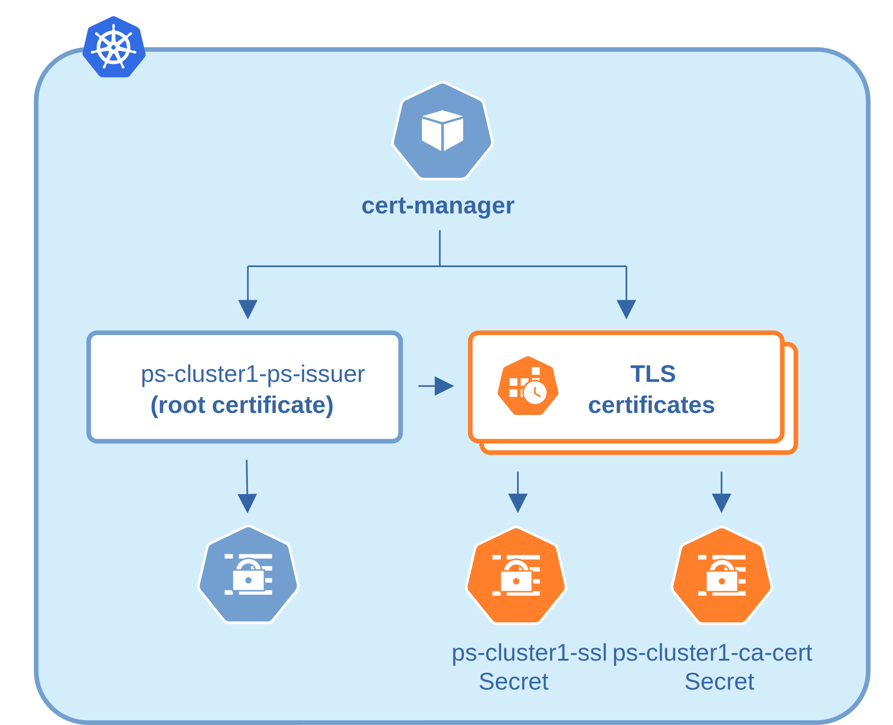

## Update certificates

How your TLS certificates are updated depends on how they were created:

* Certificates generated by the Operator are long-term. If you need to rotate them, you must do it manually.

* Certificates issued by the cert-manager are short-term. They are valid for 3 months. The cert-manager automatically reissues the certificates on schedule and without downtime.

   

* Certificates manually generated by you are not renewed automatically. It is your responsibility to timely update them. Use the steps in the following sections for how to do it.

### Check your certificates for expiration

If you [use cert-manager](#install-and-use-the-cert-manager):

1. Check the necessary secrets names (ps-cluster1-ssl and ps-cluster1-ca-cert by default):

    ```bash 
    kubectl get certificate -n $NAMESPACE
    ```

    ??? example "Sample output"

        ```{text .no-copy}
        ps-cluster1-ca-cert   True    ps-cluster1-ca-cert   45m
        ps-cluster1-ssl       True    ps-cluster1-ssl       43m
        ```

2. Optionally you can also check that the certificates issuer is up and running:
    
    ```bash
    kubectl get issuer -n $NAMESPACE
    ```

    The response should be as follows:

    ``` {.text .no-copy}
    NAME                              READY   AGE
    ps-cluster1-ps-ca-issuer   True    40m
    ps-cluster1-ps-issuer      True    38m
    ```

    !!! note
    
        If you don't use cert-manager, list your secrets:

        ```bash
        kubectl get secrtes -n $NAMESPACE
        ```

        Then either use the default ones or the one you created

3. Use the following command to find out the certificates validity dates,
    substituting Secrets names if necessary:

    ```bash
    {
    kubectl get secret/ps-cluster1-ca-cert -n ps -o jsonpath='{.data.tls\.crt}' | base64 --decode | openssl x509 -noout -dates
    kubectl get secret/ps-cluster1-ssl -o jsonpath='{.data.ca\.crt}' | base64 --decode | openssl x509 -noout -dates
    }
    ```

    ??? example "Sample output"

        ```{.text .no-copy}
        notBefore=Nov  7 10:54:00 2025 GMT
        notAfter=Nov  7 10:54:00 2026 GMT
        ```


