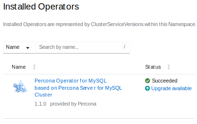

# Upgrade the Operator and CRD via Operator Lifecycle Manager (OLM)

The upgrade on OpenShift consists of two steps:

* Upgrade the Operator Deployment
* [Upgrade the database cluster](update-db.md)

## Upgrade the Operator via Operator Lifecycle Manager (OLM)

You can upgrade the Operator Deployment for MySQL that was [installed on the OpenShift platform using OLM](openshift.md#install-via-the-operator-lifecycle-manager-olm) directly through the Operator Lifecycle Manager.

If you know the OLM upgrade workflow, jump to the [update Deployment steps](#upgrade-the-operator).

### Understand how OLM applies Operator upgrades

OLM manages the Operator using a resource called a `ClusterServiceVersion` (CSV).
Each CSV represents a specific version of the Operator and contains:

* the Operator Deployment specification
* required RBAC permissions
* CRD definitions
* metadata and examples

When a new Operator version is available and the upgrade is approved, OLM installs the new CSV and reconciles the Operator Deployment to match it.
The following items are replaced with the values defined in the new CSV:

* container image
* command and arguments
* labels and annotations
* probes
* most Deployment fields

If you previously customized the Operator Deployment manually, these changes are overwritten during the upgrade.

The CRD may be updated too, if the new Operator version introduces schema changes.
However, OLM doesn't modify the `PerconaServerMySQL` Custom Resource. It remains unchanged and continues running with its current configuration. For how to update it, refer to [Update Percona Server for MySQL](update-db.md).

#### Persisting custom Operator configuration

If you need to customize the Operator Deployment (for example, to adjust resource limits or set environment variables), you can do it through the Subscription.

A Subscription is the OLM resource that defines which operator you want to install and how you want it to be upgraded. A Subscription connects your cluster to an Operator package in a CatalogSource and ensures that OLM continuously manages that Operator according to your chosen update strategy.

Here's how you can customize the Operator Deployment. This example command sets an environment variable for the Operator:

```bash
kubectl patch subscription percona-server-mysql-operator -n <namespace> \
  --type merge \
  -p '{"spec":{"config":{"env":[{"name":"LOG_LEVEL","value":"DEBUG"}]}}}'
```

OLM supports overriding only the following fields through the Subscription:

* env
* envFrom
* volumes
* volumeMounts
* resources
* nodeSelector
* tolerations
* affinity

These overrides are applied on top of the CSV and persist across upgrades. All other fields are overridden by the values from the new CSV during the Operator Deployment upgrade.

### Upgrade the Operator

1. Log in to the OpenShift web console and check the list of installed Operators in your namespace to see if upgrades are available.

    

2. Click the "Upgrade available" link to review details, click "Preview InstallPlan," and then click "Approve" to upgrade the Operator.

